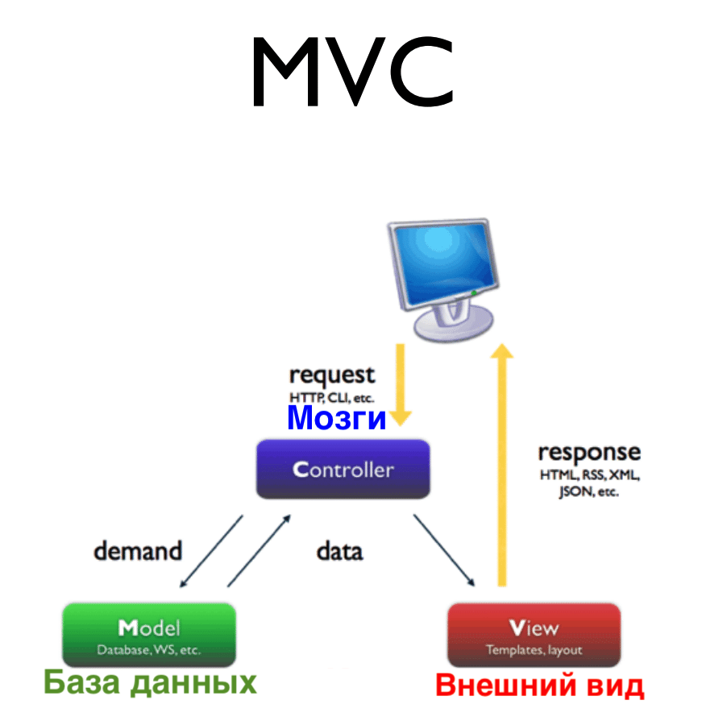

### CS50

***[Algorithm](https://ru.wikipedia.org/wiki/%D0%90%D0%BB%D0%B3%D0%BE%D1%80%D0%B8%D1%82%D0%BC#.D0.9C.D0.B0.D1.88.D0.B8.D0.BD.D0.B0_.D0.A2.D1.8C.D1.8E.D1.80.D0.B8.D0.BD.D0.B3.D0.B0)*** - набор действий для пошагового решения проблемы. Это конечная совокупность точно заданных правил решения некоторого класса задач или набор инструкций, описывающих порядок действий исполнителя для решения определённой задачи.

***Свойства алгоритмов***

Различные определения алгоритма в явной или неявной форме содержат следующий ряд общих требований:

***Дискретность*** — алгоритм должен представлять процесс решения задачи как упорядоченное выполнение некоторых простых шагов. При этом для выполнения каждого шага алгоритма требуется конечный отрезок времени, то есть преобразование исходных данных в результат осуществляется во времени дискретно.

***Детерминированность (определённость)***. В каждый момент времени следующий шаг работы однозначно определяется состоянием системы. Таким образом, алгоритм выдаёт один и тот же результат (ответ) для одних и тех же исходных данных. С другой стороны, существуют вероятностные алгоритмы, в которых следующий шаг работы зависит от текущего состояния системы и генерируемого случайного числа. 

***Завершаемость (конечность)*** — в более узком понимании алгоритма как математической функции, при правильно заданных начальных данных алгоритм должен завершать работу и выдавать результат за определённое число шагов.

***Массовость (универсальность)***. Алгоритм должен быть применим к разным наборам начальных данных.


***Время работы***

Распространённым критерием оценки алгоритмов является время работы и порядок роста продолжительности работы в зависимости от объёма входных данных.

Для каждой конкретной задачи составляют некоторое число, которое называют её размером. Например, размером задачи вычисления произведения матриц может быть наибольший размер матриц-множителей, для задач на графах размером может быть количество ребер графа.

Время, которое тратит алгоритм как функция от размера задачи `n`, называют временной сложностью этого алгоритма `T(n)`. Асимптотику поведения этой функции при увеличении размера задачи называют асимптотичной временной сложностью, а для её обозначения используют нотацию «O» большое. 

«***O***» большое и «***o***» малое — математические обозначения для сравнения ***асимптотического поведения (асимптотики)*** функций. Под асимптотикой понимается характер изменения функции при стремлении её аргумента к определённой точке.

Например, если алгоритм обрабатывает входные данные размером `n` за время `cn²`, где `c` — некоторая константа, то говорят, что временная сложность такого алгоритма `O(n²)`. 

Асимптотическая сложность важна тем, что является характеристикой алгоритма, а не его конкретной реализации: «оптимизацией» операций, без замены алгоритма, можно изменить только мультипликативный коэффициент `c`, но не асимптотику. Aсимптотическая сложность является главным фактором, который определяет размер задач, которые алгоритм способен обработать.

 </img>

 </img>

Алгоритм — это точно определённая инструкция, последовательно применяя которую к исходным данным, можно получить решение задачи. Например, в алгоритме деления вещественных чисел делимое может быть любым, а делитель не может быть равен нулю.

Алгоритм служит, как правило, для решения не одной конкретной задачи, а некоторого класса задач. Так, алгоритм сложения применим к любой паре натуральных чисел. В этом выражается его свойство ***массовости***, то есть возможности применять многократно один и тот же алгоритм для любой задачи одного класса.

---
"Hello World" на языке Си

```C
#include <stdio.h>
int main(void) {
  printf("Hello World\n");
  return 0;
}
```

Программы в Cи состоят из функций, а те — из операторов и переменных. **Функция** — это кусок кода, в котором уже есть или подаются какие-то данные, а какие-то данные получаются в результате её исполнения. 

`printf()` из стандартной библиотеки `stdio` выводит любую строку на экран. Строки заключаются в двойные кавычки, а символ `\n` означает перевод курсора на новую строку. 

**Компилятор** - принимает на вход исходный код, и преобразует его в ассемблерный и затем в объектный код, т.е в 0 и 1, машинный код понятный компьютеру.
 </img>

`#include <stdio.h>` - дает доступ к библиотеке функций

Строка `#include` делает очень важную вещь: она подключает библиотеки уже написанного кода к вашей программе. 

Имя подключенной библиотеки идет в угловых скобках `(<>)` и носит расширение `(.h)`. Если бы не было библиотек, то любое, самое элементарное действие, пришлось бы каждый раз описывать снова и снова. Подключенная нами библиотека содержит функции ввода/вывода. Именно она позволяет нам использовать функцию `printf()` для вывода на экран. То есть, если бы мы не написали строку `#include <stdio.h>`, но оставили в теле программы функцию `printf ()`, при попытке запуска мы бы получили ошибку! Потому что без этой библиотеки компилятор не знает, что такое `printf()`. 

Есть библиотеки стандартные, они составляют словарный запас языка. Функция `printf()` не встроена в компьютер, но входит в стандартную библиотеку языка Cи

В технических терминах, библиотека — это двоичный файл, полученный путем объединения в коллекцию объектных файлов, используя компоновщик. **Объектные файлы** — это те файлы с расширением `(*.o)`, которые вы получаете при компиляции приложений

`printf("")` - функция для печати

```bash
$ ./hello
Hello World
```

`clang [name]` - один из компиляторов. Для компиляции можно также использовать уже знакомую вам программу `make`. По сути, она вызывает `clang` с определенными аргументами командной строки. 

`make [name]` - команда компилирует указанный файл `name`

`./a.out` - название первой скомпилированной программы по умолчанию

```bash
$ clang hello.c
$ ./hello
Hello World
$ ./a.out
Hello World
```

```bash
$ make hello
clang   hello.o   -o hello
```

```C
#include<stdio.h>

int main(void)
{
for (int i = 0; i < 10; i++)
printf("hello, world!\n");
}
```

```C
#include <stdio.h>

int main() {
int a, b, c;
    a = 5;
    b = 7;
    c = a + b;
    printf("%d + %d = %d\n", a, b, c);
    return 0;
}
```

Например, библиотека строк [string.h](https://ru.wikipedia.org/wiki/String.h), где описаны операции со строками (определение длины, сложение и прочее) 

255 в двоичной 11111111, так как начало счета с 0 и до 255 = 256 чисел

256 в двоичной 100000000

 </img>

0x.... - шестнадцатеричная система, в ней часто записывают адреса переменных (ниже тема указателей)

[CSV](https://ru.wikipedia.org/wiki/CSV) (от англ. Comma-Separated Values — значения, разделённые запятыми) — текстовый формат, предназначенный для представления табличных данных. Строка таблицы соответствует строке текста, которая содержит одно или несколько полей, разделенных запятыми. Это примитивная база хранения данных.

---
[**Жадный алгоритм**](https://ru.wikipedia.org/wiki/%D0%96%D0%B0%D0%B4%D0%BD%D1%8B%D0%B9_%D0%B0%D0%BB%D0%B3%D0%BE%D1%80%D0%B8%D1%82%D0%BC) (*Greedy algorithm*) — алгоритм, заключающийся в принятии локально [оптимальных решений](https://ru.wikipedia.org/wiki/Оптимальное_решение) на каждом этапе, допуская, что конечное решение также окажется оптимальным.

Если глобальная оптимальность алгоритма имеет место практически всегда, его обычно предпочитают другим методам оптимизации, таким как [динамическое программирование](https://ru.wikipedia.org/wiki/Динамическое_программирование).

---

**Динамическое программирование** — способ решения сложных задач путём разбиения их на более простые подзадачи. Он применим к задачам с оптимальной подструктурой, выглядящим как набор перекрывающихся подзадач, сложность которых чуть меньше исходной. В этом случае время вычислений, по сравнению с «наивными» методами, можно значительно сократить.

Ключевая идея в динамическом программировании достаточно проста. Как правило, чтобы решить поставленную задачу, требуется решить отдельные части задачи (подзадачи), после чего объединить решения подзадач в одно общее решение. Часто многие из этих подзадач одинаковы. Подход динамического программирования состоит в том, чтобы решить каждую подзадачу только один раз, сократив тем самым количество вычислений. Это особенно полезно в случаях, когда число повторяющихся подзадач экспоненциально велико.

Метод *динамического программирования сверху* — это простое запоминание результатов решения тех подзадач, которые могут повторно встретиться в дальнейшем. *Динамическое программирование снизу* включает в себя переформулирование сложной задачи в виде [рекурсивной](https://ru.wikipedia.org/wiki/Рекурсия) последовательности более простых подзадач.

---

Общего критерия оценки применимости жадного алгоритма для решения конкретной задачи не существует, однако для задач, решаемых жадными алгоритмами, характерны две особенности:

**Принцип жадного выбора** - если последовательность локально оптимальных выборов даёт глобально оптимальное решение. В типичном случае доказательство оптимальности следует такой схеме:

1. Доказывается, что жадный выбор на первом шаге не закрывает пути к оптимальному решению: для всякого решения есть другое, согласованное с жадным выбором и не хуже первого.
2. Показывается, что подзадача, возникающая после жадного выбора на первом шаге, аналогична исходной.
3. Рассуждение завершается по индукции.

**Оптимальность для подзадач** - если оптимальное решение задачи содержит в себе оптимальные решения для всех её подзадач.

---
### Размен монет
Так, например, сумму в 24 копейки монетами в 1, 5 и 7 коп. жадный алгоритм разменивает так: 7 коп. — 3 шт., 1 коп. — 3 шт., в то время как правильное решение — 7 коп. — 2 шт., 5 коп. — 2 шт.

Представим, что кассир должен покупателю сдачу в 41 цент, а у него на поясе есть цилиндры с монетками для сдачи номиналом в 25, 10, 5 и 1 цент. Руководствующийся «жадным» алгоритмом кассир сразу же захочет выдать максимум, на первом же шаге. На этом шаге оптимальным или наилучшим решением будет выдать 25 пенсов. 41-25 = 16. Осталось выдать 16 пенсов. Очевидно, 25 пенсов слишком много, значит, остается 10. 16-10 = 6. Теперь выдаем по тому же принципу 5 пенсов, и затем — 1. Таким образом, покупатель получит всего четыре монеты номиналом 25, 10, 5 и 1 пенс.

---

### Hello World на Java
```java
public class HelloWorld {
   public static void main(String[] args) {
       // Выводим Hello World в консоль.
       System.out.println("Hello, World");
   }
}
```
---
Необходимые основы языка программирования Си для данного курса, были изучены по учебному изданию:
### [The C programming Language, Second Edition, Brian W. Kernighan, Dennis M. Ritchie](http://cpp.com.ru/kr_cbook/)

У меня есть отдельный [конспект](https://github.com/artemiosdev/C_Kernighan_and_Ritchie) по данному учебнику 

---

Примеры кода с лекций:
```C
// Coughs three times.
// Demonstrates better design via a loop.
       
#include <stdio.h>
int main(void)
{
    // cough three times
    for (int i = 0; i < 3; i++)
    {
        printf("cough\n");
    }
}
```

```C
//Coughs three times.
//Demonstrates abstraction and hierarchical decomposition.
#include <stdio.h>
// prototype
void cough(void);
int main(void)
{
    // cough three times
    for (int i = 0; i < 3; i++)
    {
        cough();
    }
}

//Coughs once.
void cough(void)
{
    printf("cough\n");
}
```

```C
//Coughs three times.
// Demonstrates parameterization.
#include <stdio.h>
// prototype
void cough(int n);
int main(void)
{
    // cough three times
    cough(3);
}

//Coughs n times.
void cough(int n)
{
    for (int i = 0; i < n; i++)
    {
        printf("cough\n");
    }
}
```

---
```C
//Prints a user's name.
//Demonstrates a function (not from a library) with a side effect.
#include <cs50.h>
#include <stdio.h>
// prototype
void PrintName(string name);
int main(void)
{
    printf("Your name: ");
    string s = GetString();
    PrintName(s);
}

//Says hello to someone by name.
void PrintName(string name)
{
    printf("hello, %s\n", name);
}
```

---
```C
//Cubes a variable.
//Demonstrates use of parameter and return value.
#include <stdio.h>
// function prototype
int cube(int a);
int main(void)
{
    int x = 2;
    printf("x is now %i\n", x);
    printf("Cubing...\n");
    x = cube(x);
    printf("Cubed!\n");
    printf("x is now %i\n", x);
}

// Cubes argument.
int cube(int n)
{
    return n * n * n;
}
```

---
```C
//Prints a string, one character per line.
//Demonstrates error checking.

#include <cs50.h>
#include <stdio.h>
#include <string.h>
int main (void)
{
 // get line of text
string s = GetString();
 // print string, one character per line
 if(s != NULL)
 {
   for(int i=0; i < strlen(s); i++)
   {
    printf("%c\n", s[i]);
   }
 }
}
```

```C
//Prints a string, one character per line.
//Demonstrates error checking.

#include <cs50.h>
#include <stdio.h>
#include <string.h>
int main (void)
{
 // get line of text
string s = GetString();
 // print string, one character per line
 if(s != NULL)
 {
   for(int i=0; i < strlen(s); i++)
   {
    printf("%c\n", s[i]);
   }
 }
}
```

```C
//Prints a string, one character per line.
//Demonstrates error checking.
#include <cs50.h>
#include <stdio.h>
#include <string.h>
int main (void)
{
 // get line of text
string s = GetString();
 // print string, one character per line
 if(s != NULL)
 {
   for(int i=0, n = strlen(s); i < n; i++)
   {
    printf("%c\n", s[i]);
   }
 }
}
```

---
### Функция 
Некий «чёрный ящик». В этот ящик попадают входные данные ***inputs***, над ними производятся некие манипуляции, а на выходе из этого ящика мы получаем результат ***output***.

-Упорядочивание кода. Код гораздо проще поддерживать, если он разбит на функции, и каждая из них делает чётко определенную небольшую часть работы.

- Упрощение кода. Вам не нужно знать, как работает функция, главное — результат её работы. Это упрощает понимание большой программы.

- Повторное использование. Если вам нужно сделать подобные действия в различных частях программы, можно написать всего одну функцию, и использовать её многократно.

```C
#include <stdio.h>

int cube(int input); //Прототип функции cube

int main(void)
{
     int x = 2;
     printf("x is %i\n", x);
     x = cube(x);
     printf("x is %i\n", x);
}

int cube(int input)
{
     int output = input * input * input;
     return output;
}
```
Result

```bash
x is 2
x is 8
```

***Прототип функции*** (header) называют объявления заголовка функции, без тела. Прототип указывает компилятору, что существует функция с определенным именем, типом результата и списком параметров, тело которой будет описано позже в коде.

***Тип результата (return type)***
На Си нужно всегда указывать тип результата. То есть мы должны явно указать, какого типа будет то значение, которое должна вернуть функция.

***Список параметров (parameter list)***
Перечень входных данных для функции. Функция может не иметь параметров, может иметь один или несколько параметров. Для каждого параметра нужно указать его имя и тип. В примере функция принимает единственный параметр — целое число int input.

В теле (body) описаны действия, которые выполняет функция. Слово *** `return`*** указывает на конец работы функции и указывает значение, которое возвращает функция в качестве результата её работы (значение переменной `output` в примере). Функция может и не возвращать никакого результата.

---
### Указатель в языке Си
Это переменная, содержащая ***адрес объекта***. Указатель не несет информации о содержимом объекта, а содержит сведения о том, где размещен объект.

Память компьютера можно представить в виде последовательности пронумерованных однобайтовых ячеек, с которыми можно работать по отдельности или блоками.

Каждая переменная в памяти имеет свой адрес — номер первой ячейки, где она расположена, а также свое значение. ***Указатель*** — это тоже переменная, которая размещается в памяти. Она тоже имеет адрес, а ее значение является адресом некоторой другой переменной. Переменная, объявленная как указатель, занимает 4 байта в оперативной памяти (в случае 32-битной версии компилятора).

Указатель, как и любая переменная, должен быть объявлен.

***Тип указателя***— это тип переменной, адрес которой он содержит.

Для работы с указателями в Си определены две операции:

***операция * (звездочка)*** — позволяет получить ***значение объекта по его адресу*** — определяет значение переменной, которое содержится по адресу, содержащемуся в указателе;

***операция & (амперсанд)*** — позволяет определить ***адрес переменной***.

```C
char c;   // переменная
char *p; // указатель
p = &c;  // p = адрес c
```
 </img>

|   | Переменная | Указатель |
|:------------- |:---------------:| -------------:|
| Адрес | &c | p |
| Значение | c | *p |

Программа, меняет местами значения переменных `x` и `y`
```C
#include <stdio.h>

void swap(int* a, int* b); //Прототип функции swap

int main(void)
{
     int x = 1, y = 2;
     swap(&x, &y);
     printf("x is %i\n", x);
     printf("y is %i\n", y);
}

void swap(int* a, int* b)
{
     int tmp = *a;
     *a = *b;
     *b = tmp;
}
```
Result:

```bash
x is 2
y is 1
```

---
### Криптография. Шифр Цезаря и шифр Виженера
***[Шифр Цезаря](https://ru.wikipedia.org/wiki/%D0%A8%D0%B8%D1%84%D1%80_%D0%A6%D0%B5%D0%B7%D0%B0%D1%80%D1%8F)***

В этом шифре каждая буква текста заменяется на другую, которая находится на фиксированное число букв дальше в алфавите. Это фиксированное число букв называется ***ключом***. Так, ключ 1 переводит букву латиницы C в букву D, а Z — по циклу в A. Если ключ равен 3, то буква C перейдет в F, а Z — в C. 

Примеры: используем шифр Цезаря с ключом 5 на слове cat.
```bash
c -> h
a -> f
t -> y
Caesar (cat, 5) = hfy
```
Обозначим незашифрованный текст буквой `p`, а `pi` — буква в тексте `p`, которая находится на позиции с номером `i`. Назовем секретный ключ буквой `k`, `с` — зашифрованный текст, а `ci` — буква в шифрованном тексте, которая находится на позиции `i`. Тогда вычислить каждую букву шифра можно по формуле: 

`ci = (pi + k) % 26`

Если сопоставить каждому символу алфавита его порядковый номер (нумеруя с 0), то шифрование и дешифрование можно выразить формулами модульной арифметики:

```C
y = (x + k) mod n
x = (y - k) mod n
```
где `x` — символ открытого текста, `y` — символ шифрованного текста, `n` — мощность алфавита, а `k`— ключ

Если ключ `k = 13` а изначальный текст `p` — «Be sure to drink your Ovaltine!», вот какой шифр мы получим:

`Or fher gb qevax lbhe Binygvar!`

Обратите внимание, O (первая буква в шифрованном тексте) смещена на 13 позиций от буквы B (первая буква в оригинальном тексте). То же самое с буквой r (вторая буква в шифровке) смещена на 13 букв от e (вторая буква в оригинале). Третья буква в шифровке, f, смещена на 13 букв от s (третья в оригинале), тут мы ходим по кругу от z до a.

Шифр Цезаря с ключом 13 имеет специальное название `ROT13`. Он симметричный: применив его дважды, мы вернемся к изначальному тексту. 

***[Шифр Виженера](https://ru.wikipedia.org/wiki/%D0%A8%D0%B8%D1%84%D1%80_%D0%92%D0%B8%D0%B6%D0%B5%D0%BD%D0%B5%D1%80%D0%B0)***

Он несколько безопаснее шифра Цезаря: в качестве ключа в нем используется слово и его сложно взломать вручную с помощью одного только частотного анализа или перебора. Каждая буква ключа генерирует число, и в результате мы получаем несколько ключей для сдвига букв.

 </img>

Пусть `р` – некоторый текст, `k` — ключевое слово, `kj` — `j`-я буква ключа, `pi` — буква под номером `i` в оригинальном тексте, `ci` — буква под номером `i` в шифровке. Тогда:

`ci = (pi + kj) % 26`

Или

Если `n`  — количество букв в алфавите, `mj` — номер буквы открытого текста, `kj` — номер буквы ключа в алфавите, то шифрование Виженера можно записать следующим образом:

`cj = (mj + kj) mod n`

И расшифровывание:

`mj = (cj - kj) mod n`

---
### Линейный поиск
Это способ последовательного поиска, один за одним. 
Пример. пусть у нас есть список чисел:

2 4 0 5 3 7 8 1

И нам нужно найти 0. Мы его видим сразу, но компьютерная программа так не работает. Она начинает с начала списка и видит число 2. Затем проверяет, 2=0? Это не так, поэтому она продолжает работу и переходит ко второму символу. Там её тоже ждет неудача, и только на третьей позиции алгоритм находит нужное число.

Псевдокод линейного поиска: 

```C
linearSearch(key, array[]):
	for(i = 0; i < length(array); i++):
		if(array[i] == key):
			return i
return -1
```
Функция `linearSearch` получает на вход два аргумента — ключ `key` и массив `array[]`. Ключ — искомое значение, в предыдущем примере `key = 0`. Массив — список чисел, которые мы будем просматривать. Если мы ничего не нашли, функция вернет `return -1` (позицию, которой в массиве нет). Если же линейный поиск найдет нужный элемент, то функция вернет позицию, на которой находится искомый элемент в массиве.

В линейном поиске хорошо то, что он будет работать для любого массива, независимо от порядка элементов: мы всё равно пройдём по всему массиву. Это же является и его слабостью. 

---
### Двоичный/Бинарный поиск
Также известен как метод деления пополам («методом разрывания телефонного справочника пополам») или дихотомия — классический алгоритм поиска элемента в отсортированном массиве (векторе), использующий дробление массива на половины.

**Рекурсивный подход.** В этом случае пишется функция, которая вызывает сама себя (рекурсивно), пока не будет найден искомый элемент в массиве.

 </img>

Поиск элемента в отсортированном массиве:

1.Определение значения элемента в середине структуры данных. Полученное значение сравнивается с ключом.

2.Если ключ меньше значения середины, то поиск осуществляется в первой половине элементов, иначе — во второй.

3.Поиск сводится к тому, что вновь определяется значение серединного элемента в выбранной половине и сравнивается с ключом.

4.Процесс продолжается до тех пор, пока не будет найден элемент со значением ключа или не станет пустым интервал для поиска.

Мы нашли 7 в массиве из 17 элементов с помощью бинарного поиска всего за три шага. Линейный поиск в такой же ситуации справился бы аж за 16 шагов. Поскольку этот алгоритм на каждом шаге уменьшает количество элементов в массиве вдвое, он найдет искомое за асимптотическое время `О(log n)`, где `n` – количество элементов в списке. То есть, в нашем случае асимптотическое время = `O(log 17)` (это чуть больше трёх). 

Псевдокод функции бинарного поиска: 

```C
binarySearch(key, array[], min, max):

if (max < min):
return -1
else:
midpoint = findMidPoint(min, max)

if (array[midpoint] < key):
binarySearch(key, array, midpoint + 1, max)
else if (array[midpoint] > key):
binarySearch(key, array, min, midpoint - 1)
else:
return midpoint
```
Функция принимает на вход 4 аргумента: искомое `key`, массив данных `array[]`, в котором находится искомое, `min` и `max` — указатели на максимальное и минимальное число в массиве, на которое мы смотрим на данном шаге алгоритма.

Для нашего примера изначально дана такая картинка: 

 </img>

Разберем код, `midpoint` — наша середина массива. Она зависит от крайних точек и находится по центру между ними. После того, как мы нашли середину, проверяем, меньше ли она нашего числа `key`. 

`midpoint = findMidPoint(min, max)`

`if (array[midpoint] < key):`

`binarySearch(key, array, midpoint + 1, max)`

Если это так, то `key` также больше, чем любое из чисел левее середины, и мы можем вызвать бинарную функцию снова, только теперь наш `min = midpoint + 1`. Если окажется, что `key < midpoint`, мы можем отбросить само это число и все числа, лежащие справа от него. И мы вызываем бинарный поиск по массиву от числа `min` и вплоть до значения `(midpoint – 1)`. 

`else if (array[midpoint] > key):`

`binarySearch(key, array, min, midpoint - 1)`

Третья ветка: если значение в `midpoint` не больше и не меньше, чем `key`, ему ничего не остается, как быть искомым числом. Его мы и возвращаем в таком случае и заканчиваем работу программы.

`else:`

`return midpoint`

Наконец, может статься так, что искомое число и вовсе отсутствует в массиве. Для учёта этого случая делаем такую проверку: 

`if (max < min):`

`return -1`

И возвращаем (-1), чтобы указать, что мы ничего не нашли. 

Пример из лекции №8

```C
on input of n elements
	if n < 2
		return
	else
		sort left half of elements
		sort right half of elements
		merge sorted halves
```

 </img>

У нас 8 элементов, 3 действия и высота диатраммы 3, можно выразить `log2x`

```C
#include <stdio.h>
#include <math.h> 

int main (void)
{    
   printf ("Argument: 8 \n");
   printf ("log2 : %.0f\n", log2 (8) );
   return 0;
}
```
Время выполнения займет у нас `O (log n)`

Сложность времени `O (log n)` - логарифмический порядок. Когда данные увеличиваются в `n` раз, затраты времени увеличиваются в `log n` раз (журнал здесь основан на 2, например, когда данные увеличиваются в 256 раз, требующие много времени только увеличение в 8 раз - это временная сложность ниже линейной). Двоичный поиск - это алгоритм `O (log n)`. Каждый поиск исключает половину возможностей. Поиск по 256 данным может найти цель за 8 раз.

 </img>

***[Cортировка слиянием](https://neerc.ifmo.ru/wiki/index.php?title=%D0%A1%D0%BE%D1%80%D1%82%D0%B8%D1%80%D0%BE%D0%B2%D0%BA%D0%B0_%D1%81%D0%BB%D0%B8%D1%8F%D0%BD%D0%B8%D0%B5%D0%BC)*** она займет  `O (n log n)` или `T(n) = T(n/2) + T(n/2) + O(n)`. 

---
### Бинарное дерево
Вы уже знаете, что для бинарного поиска необходимо, чтобы массив был отсортирован. Таким образом, если у нас есть неотсортированный массив, в котором нужно найти некий элемент, у нас есть два варианта действий: 

1.Отсортировать список и применить бинарный поиск.

2.Сохранять список всегда отсортированным при одновременном добавлении и убирании из него элементов.

Один из способов хранения списков отсортированными считается бинарное дерево поиска. Бинарное (двоичное) дерево поиска — это структура данных, которая отвечает следующим требованиям: 

Оно является деревом (структурой данных, эмулирующей древовидную структуру — имеет корень и другие узлы (листья), связанные «ветками» или ребрами без циклов).

Каждый узел имеет 0, 1 или 2 потомка.

Оба поддерева — левое и правое — являются двоичными деревьями поиска.

У всех узлов левого поддерева произвольного узла X значения ключей данных меньше, нежели значение ключа данных самого узла X.

У всех узлов правого поддерева произвольного узла X значения ключей данных больше либо равно, нежели значение ключа данных самого узла X.

 </img>

Каждая ячейка называется вершиной, вершины соединены ребрами. Корень дерева — ячейка с номером 13. 

Если нужно найти максимальное число — идем от вершины вниз и вправо. Нахождение числа, которое не является минимальным или максимальным также весьма простое. Мы спускаемся от корня влево или вправо в зависимости от того, больше или меньше наша вершина искомой.

Еще можно выводить числа в порядке сортировки. Например, если нам нужно вывести все числа в порядке возрастания, берем левое поддерево и начиная с самой левой вершины идем наверх. 

Прибавить что-то в дерево тоже просто. Главное помнить о структуре. Скажем, нам нужно добавить в дерево значение 7. Идем к корню, и проверяем. Число 7 < 13, поэтому идем влево. Там видим 5, и идем вправо, поскольку 7 > 5. Дальше поскольку 7 < 8 и 8 не имеет потомков, мы конструируем ветку от 8 влево и на неё цепляем 7. 

 </img>

Также можно удалять вершины из дерева, но это несколько сложнее. 
Есть три разных сценария для удаления, которые мы должны учесть. 

1.Самый простой вариант: нам нужно удалить вершину, у которой нет потомков. Например, число 7, которое мы только что добавили. В таком случае мы просто проходим путь до вершины с этим числом и удаляем его.

2.У вершины есть одна вершина-потомок. В таком случае можно удалить нужную вершину, но её потомка нужно подсоединить к «дедушке», то есть вершине, из которой произрастал её непосредственный предок. Например, из того же дерева нужно удалить число 3. В таком случае, её потомка, единицу, вместе со всем поддеревом присоединяем к 5. Это делается просто, поскольку все вершины, слева от 5, будут меньше чем это число (и меньше, чем удалённая тройка).

3.Самый сложный случай — когда у удаляемой вершины есть два потомка. Теперь первым делом нам нужно найти вершину, в которой спрятано следующее большее значение, нужно поменять их местами, а потом удалить нужную вершину. Обратите внимание: следующая по значению вершина не может иметь двух потомков, тогда её левый потомок будет лучшим кандидатом на следующее значение.

Давайте из нашего дерева удалим корневую вершину 13. Сначала ищем самое близкое к 13 число, которое его больше. Это 21. Меняем 21 и 13 местами и удаляем 13.

 </img>

Что будет, если мы попробуем построить бинарное дерево из отсортированного списка? 1 2 3 4 5 6
Все числа просто будут прибавляться в правую ветку предыдущего. Если мы захотим найти число, у нас не будет другого выхода, как просто идти по цепочке вниз. Это ничуть не лучше, чем линейный поиск.

---
### Побитовые операторы
В Си имеются шесть операторов для манипулирования с битами. Их можно применять только к целочисленным операндам, т. е. к операндам типов `char`, `short`, `int` и `long`, знаковым и беззнаковым.     

`&` - побитовое И 

```
0 & 0 0
1 & 0 0
0 & 1 0
1 & 1 1
```

`|` - побитовое ИЛИ  

```
0 | 0 0
1 | 0 1
0 | 1 1
1 | 1 1
```

`^` - побитовое исключающее ИЛИ (XOR). 

```
0 ^ 0 0
0 ^ 1 1
1 ^ 0 1
1 ^ 1 0
```

`<<` - сдвиг влево.      
`>>` - сдвиг вправо.     

`~` - побитовое отрицание (унарный) как привычный `!=`

```
~0 1
~1 0
```

Оператор ` & ` (***побитовое И***) часто используется для обнуления некоторой группы разрядов. Например

`n = n & 0177;`
обнуляет в `n` все разряды, кроме младших семи.

Оператор ` | ` (***побитовое ИЛИ***) применяют для установки разрядов; так,

`x = x | SET_ON;`
устанавливает единицы в тех разрядах `x`, которым соответствуют единицы в `SET_ON`.

Оператор ` ^ ` (***побитовое исключающее ИЛИ***) в каждом разряде установит 1, если соответствующие разряды операндов имеют различные значения, и 0, когда они совпадают.

Поразрядные операторы `&` и `|` следует отличать от логических операторов && и ||, которые при вычислении слева направо дают значение истинности. 
Например, если `x` равно 1, а `y` равно 2, то `x & y` даст нуль, а `x && y` - единицу.

Операторы `<<` и `>>` сдвигают влево или вправо свой левый операнд на число битовых позиций, задаваемое правым операндом, который должен быть неотрицательным. 
Так, `x << 2` сдвигает значение `x` влево на 2 позиции, заполняя освобождающиеся биты нулями, что эквивалентно умножению `x` на `4`. 

Сдвиг вправо беззнаковой величины всегда сопровождается заполнением освобождающихся разрядов нулями. Сдвиг вправо знаковой величины на одних машинах происходит с распространением знака ("арифметический сдвиг”), на других - с заполнением освобождающихся разрядов нулями ("логический сдвиг”).

Унарный оператор ` ~ ` поразрядно "обращает” целое т. е. превращает каждый единичный бит в нулевой и наоборот. Например
`x = x & ~077`

обнуляет в `x` последние 6 разрядов. Заметим, что запись x & ~077 не зависит от длины слова, и, следовательно, она лучше, чем x & 0177700, поскольку последняя подразумевает, что x занимает 16 битов. Не зависимая от машины форма записи ~077 не потребует дополнительных затрат при счете, так как ~077 - константное выражение, которое будет вычислено во время компиляции.

Для иллюстрации некоторых побитовых операций рассмотрим функцию `getbits(x, p, n)`, которая формирует поле в `n` битов, вырезанных из `x`, начиная с позиции `p`, прижимая его к правому краю. Предполагается, что 0-й бит - крайний правый бит, а `n` и `p` осмысленные положительные числа. Например, `getbits(x,4,3)` вернет в качестве результата 4, 3 и 2-й биты значения `x`, прижимая их к правому краю. Вот эта функция:

```C
/* getbits: получает n бит, начиная с p-й позиции */ 
unsigned getbits(unsigned x, int p, int n)
{
    return (x >> (p+1-n)) & ~(~0 << n);
}
```

Выражение `x >> (р+1-n)` сдвигает нужное нам поле к правому краю. Константа `~0` состоит из одних единиц, и ее сдвиг влево на `n` бит `(~0 << n)` приведет к тому, что правый край этой константы займут `n` нулевых разрядов. Еще одна операция побитовой инверсии `~` позволяет получить справа `n` единиц.

---
### Алгоритмы сортировки. Сортировка выбором
Основная идея — разбить наш список на две части, отсортированную и неотсортированную. На каждом шаге алгоритма новое число перемещается из неотсортированной части в отсортированную, и так пока все числа не окажутся в отсортированной части. 

1.Находим минимальное неотсортированное значение.
2.Меняем местами это значение с первым неотсортированным значением, ставя его таким образом в конец отсортированного массива.
3.Если остались неотсортированные значения, возвращаемся к шагу 1.

Метод сортировки прямым выбором основан на следующих правилах:
1.Выбирается элемент с наименьшим ключом.
2.Он меняется местами с первым элементом a0.
3.Затем эти операции повторяются с оставшимися n-1 элементами, n-2 элементами и так далее до тех пор, пока не останется один, самый большой элемент.

 </img>

На первом шаге все значения являются неотсортированными. Назовем неотсортированную часть — Unsorted, а отсортированную — Sorted 

 </img>

Шаг второй. На число 2 мы не смотрим, оно уже в отсортированном подмассиве. Начинаем искать минимальное, начиная со второго элемента, это 5. Убеждаемся, что 3 — минимальное среди неотсортированных, 5 — первое среди неотсортированных. Меняем их местами и прибавляем 3 к отсортированному подмассиву.

 </img>

На третьем шаге мы видим, что в неотсортированном подмассиве самое маленькое число — 4. Меняем его с первым числом среди неотсортированных — 5. 

 </img>

На четвертом шаге мы обнаруживаем, что в неотсортированном массиве минимальное число — 5. Меняем его с 6 и прибавляем к отсортированному подмассиву.

Когда среди неотсортированных остается только одно число (наибольшее), это значит, что весь массив отсортирован! 

Таким образом, ожидаемая скорость алгоритма в лучшем и худшем случае — Θ(n2) = O(n2). n в квадрате

```C
#include <stdio.h>
#include <malloc.h>
 
int main()
{
    int N;
    printf("Input N: ");
    scanf("%d", &N);
    int* mass;
    mass = (int *)malloc(N * sizeof(int));
    printf("Input the array elements:\n");
    for (int i = 0; i < N; i++)
        scanf("%d", &mass[i]);
        
    //сортировка методом выбора
    int minPosition, tmp;
 
    for (int i = 0; i < N; i++)
    {
        minPosition = i;
        for (int j = i + 1; j < N; j++)
            if (mass[minPosition] > mass[j])
                minPosition = j;
        tmp = mass[minPosition];
        mass[minPosition] = mass[i];
        mass[i] = tmp;
    }
 
    printf("Sorted array:\n");
    for (int i = 0; i < N; i++)
        printf("%d ", mass[i]);
    printf("\n");
    free(mass);
    return 0;
}
```
Result:

```bash
Input N: 5
Input the array elements:
2
4
3
5
1
Sorted array:
1 2 3 4 5 
```

или другая реализация

```C
#define _CRT_SECURE_NO_WARNINGS // для корректной работы scanf()
#include <stdio.h>

// Функция сортировки прямым выбором
void selectionSort(int *num, int size)
{
  int min, temp; // для поиска минимального элемента и для обмена
  for (int i = 0; i < size - 1; i++) 
  {
      
    min = i; // запоминаем индекс текущего элемента
    
    // ищем минимальный элемент чтобы поместить на место i-ого
    for (int j = i + 1; j < size; j++)  // для остальных элементов после i-ого
    {
      if (num[j] < num[min]) // если элемент меньше минимального,
        min = j;       // запоминаем его индекс в min
    }
    
    // меняем местами i-ый и минимальный элементы
    temp = num[i];      
    num[i] = num[min];
    num[min] = temp;
  }
}

int main() 
{
  int a[10]; // Объявляем массив из 10 элементов
  // Вводим значения элементов массива
  for (int i = 0; i < 10; i++) 
  {
    printf("a[%d] = ", i);
    scanf("%d", &a[i]);
  }
  
  selectionSort(a, 10);  // вызываем функцию сортировки
  // Выводим отсортированные элементы массива
  for (int i = 0; i<10; i++)
    printf("%d ", a[i]);
  getchar(); getchar();
  return 0;
}
```

Result:
```bash
a[0] = 2
a[1] = 4
a[2] = 6
a[3] = 8
a[4] = 9
a[5] = 3
a[6] = 4
a[7] = 1
a[8] = 7
a[9] = 3
1 2 3 3 4 4 6 7 8 9
```

---
### Пузырьковая сортировка (Bubble sort)

Идем вдоль всего массива и сравниваем 2 соседних элемента. Если они в неправильном порядке, меняем их местами. При первом проходе в конце окажется («всплывет») самый маленький элемент (если мы сортируем в порядке убывания). 

Повторять первый шаг, если хотя бы один обмен на предыдущем шаге был совершен.

Шаг 1: идем по массиву. Алгоритм начинает работу с первых двух элементов, 8 и 6 и проверяет, находятся ли они в правильном порядке. 8 > 6, поэтому меняем их местами. Далее мы смотрим на второй и третий элементы, теперь это 8 и 4. Из тех же соображений меняем их местами. В третий раз сравниваем 8 и 2. Итого, мы делаем три обмена (8, 6), (8, 4), (8, 2). Значение 8 «всплыло» в конец списка на правильную позицию. 

Шаг 2: меняем местами (6,4) и (6,2). 6 теперь на предпоследней позиции, и её можно не сравнивать с уже отсортированным «хвостом» списка

Шаг 3: меняем местами 4 и 2. Четверка «всплывает» на свое законное место. 

Шаг 4: проходимся по массиву, но менять нам уже нечего. Это сигнализирует о том, что массив полностью отсортирован. 


Пузырьковая сортировка проходит за время O(n2) в худшем случае (все числа стоят неправильно), поскольку нам нужно сделать n шагов на каждой итерации, которых тоже n. На самом деле, как и в случае с алгоритма сортировки выбором, время будет несколько меньше (n2/2 – n/2) (n в квадрате), но этим можно пренебречь. 

В лучшем случае (если все элементы уже стоят на своем месте), мы справимся за n шагов, т.е. Ω(n), поскольку нам нужно будет просто пробежаться по массиву один раз и убедиться, что все элементы стоят на своих местах (т.е. даже n-1 элементов).

 </img>

```C
#include <stdio.h>

void printArr (int array[], int n);
void sortArr (int array[], int n);

int main (void)
{
  const int n = 10;
  int array[10] = { 9, 8, 7, 6, 5, 4, 3, 2, 1, 0 };

  printArr (array, n);
  sortArr (array, n);
  printArr (array, n);
}

void
printArr (int array[], int n)
{
  for (int i = 0; i < n; i++)
    {
      printf ("%i ", array[i]);
    }
  printf ("\n");
}

void
sortArr (int array[], int n)
{
  int temp, count = 0;

  for (int swaps = 1, i = 0; swaps > 0; i++)
    {
      swaps = 0;
      for (int j = 0; j < n - 1 - i; j++)
	{
	  if (array[j] > array[j + 1])
	    {

// swaps the values.
	      temp = array[j];
	      array[j] = array[j + 1];
	      array[j + 1] = temp;

// increases the count.
	      swaps++;
	    }

// increases iterations.
	  count++;
	}
    }
  printf ("Iterations: %i\n", count);
}
```

Result:
```bash
9 8 7 6 5 4 3 2 1 0 
Iterations: 45
0 1 2 3 4 5 6 7 8 9
```

---
### Сортировка вставками (Insertion sort)
Основная идея этого алгоритма — разделение нашего массива на две части, отсортированную и неотсортированную. На каждом шаге алгоритма число переходит от неотсортированной к отсортированной части.

Берем каждый неотсортированный элемент `n` и сравниваем его со значениями в отсортированном подмассиве справа налево, пока не определим подходящую позицию для `n` (то есть, в тот момент, когда находим первое число, которое меньше, чем `n`). Затем сдвигаем все отсортированные элементы, которые находятся справа от этого числа вправо, чтобы образовалось место для нашего `n`, и вставляем его туда, тем самым расширяя отсортированную часть массива.

Для каждого неотсортированного элемента `n` нужно: 

- Определить место в отсортированной части массива, куда нужно вставить `n`
- Сдвинуть отсортированные элементы вправо, чтобы сделать лакуну для `n`
- Вставить `n` в образовавшуюся лакуну в отсортированной части массива.

Рассмотрим на примере числовой последовательности процесс сортировки методом вставок. Клетка, выделенная темно-серым цветом – активный на данном шаге элемент, ему также соответствует `i`-ый номер. Светло-серые клетки это те элементы, значения которых сравниваются с `i`-ым элементом. Все, что закрашено белым – не затрагиваемая на шаге часть последовательности.

 </img>

 </img>

Таким образом, получается, что на каждом этапе выполнения алгоритма сортируется некоторая часть массива, размер которой с шагом увеличивается, и в конце сортируется весь массив целиком.

 </img>

Шаг 1. Возьмем первое неотсортированное значение (3) и вставим его в отсортированный подмассив. На этом шаге весь отсортированный подмассив, его начало и конец и будут этой самой тройкой.

Шаг 2. Поскольку 3 < 5, мы вставим 5 в отсортированный подмассив справа от 3.

Шаг 3. Теперь работаем над вставкой числа 2 в наш отсортированный массив. Сравниваем 2 со значениями справа налево, чтобы найти правильную позицию. Поскольку 2 < 5 и 2 < 3 и мы дошли до начала отсортированного подмассива. Следовательно, мы должны вставить 2 слева от 3. Для этого подвигаем 3 и 5 вправо, чтобы появилось место для двойки и вставляем её в начало массива.

Шаг 4. Нам повезло: 6 > 5, поэтому мы можем вставить это число сразу за числом 5.

Шаг 5. 4 < 6 и 4 < 5, но 4 > 3. Следовательно, мы знаем, что 4 нужно вставить справа от 3.

Снова мы вынуждены подвинуть 5 и 6 вправо для 4. 

***Асимптотическая сложность алгоритма***.
В самом плохом случае мы сделаем одно сравнение со вторым элементом, два сравнения с третьим и так далее. Таким образом, наша скорость равна `O(n2)` n в квадрате.

```C
#include <stdio.h>

void printArr (int array[], int n);
void sortArr (int array[], int n);

int main (void)
{
  const int n = 10;
  int array[10] = { 6, 5, 4, 3, 2, 1, 0, -1, -2, -3 };

  printArr (array, n);
  sortArr (array, n);
  printArr (array, n);
}

void printArr (int array[], int n)
{
  for (int i = 0; i < n; i++)
    {
      printf ("%i ", array[i]);
    }
  printf ("\n");
}

void sortArr (int array[], int n)
{
  int temp;

  for (int i = 1; i < n; i++)
    {
      for (int j = i; j > 0 && array[j] < array[j - 1]; j--)
	{
	  // swaping.
	  temp = array[j];
	  array[j] = array[j - 1];
	  array[j - 1] = temp;
	}
    }
}
```
Result:

```bash
6 5 4 3 2 1 0 -1 -2 -3 
-3 -2 -1 0 1 2 3 4 5 6 
```

---
### Сортировка слиянием
Этот алгоритм — рекурсивный, он разбивает одну большую задачу сортировки на подзадачи, выполнение которых делают его ближе к решению изначальной большой задачи. 

Основная идея — разделение неотсортированного массива на две части и сортировка отдельных половинок по рекурсивному принципу. 

Допустим, у нас есть n элементов для сортировки. Если n < 2, заканчиваем сортировку, иначе — сортируем отдельно левую и правую части массива, и потом их объединяем. 

 </img>

Делим его на две части, и продолжаем делить, пока не получим подмассивы величиной 1, которые заведомо отсортированы.

Два отсортированных подмассива можно объединить за время `O(n)` с помощью простого алгоритма: удаляем меньшее из чисел в начале каждого подмассива и вставляем его в объединенный массив. Повторяем, пока не закончатся все элементы. 

Сортировка слиянием требует времени `O(n log n)` для всех случаев. Пока мы делим массивы на половины, на каждом уровне рекурсии получаем `log n`. Затем, для слияния подмассивов нужно всего `n` сравнений. Следовательно, `O(n log n)`. Лучший и худший варианты для сортировки слиянием — одинаковы, ожидаемое время работы алгоритма = `Θ(n log n)`.

О большое `O` описывает верхнюю границу сложности.
Малое `o ` описывает верхнюю границу, исключая точную оценку.
Омега `Ω` описывает нижнюю границу сложности.
Тета `Θ` описывает точную оценку сложности.

 </img>

Еще пример с объяснением

Метод нисходящего слияния
Исходная последовательность рекурсивно разбивается на половины, пока не получим подпоследовательности по 1 элементу. Из полученных подпоследовательностей формируем упорядоченные пары методом слияния, затем - упорядоченные четверки и т.д.

Рассмотрим последовательность

Разбиваем последовательность на 2 половины (рекурсивно, пока не получим пары).
 </img>

Каждую подпоследовательность упорядочиваем методом слияния и получаем готовую последовательность.
 </img>

```C
#include <stdio.h>
#include <stdlib.h>
#define SIZE 16
// Функция сортировки нисходящим слиянием
void mergeSort(int *a, int l, int r)
{
  if (l == r) return; // границы сомкнулись
  int mid = (l + r) / 2; // определяем середину последовательности
  // и рекурсивно вызываем функцию сортировки для каждой половины
  mergeSort(a, l, mid);
  mergeSort(a, mid + 1, r);
  int i = l;  // начало первого пути
  int j = mid + 1; // начало второго пути
  int *tmp = (int*)malloc(r * sizeof(int)); // дополнительный массив
  for (int step = 0; step < r - l + 1; step++) // для всех элементов дополнительного массива
  {
    // записываем в формируемую последовательность меньший из элементов двух путей
    // или остаток первого пути если j > r
    if ((j > r) || ((i <= mid) && (a[i] < a[j]))) 
    {
      tmp[step] = a[i];
      i++;
    }
    else 
    {
      tmp[step] = a[j];
      j++;
    }
  }
  // переписываем сформированную последовательность в исходный массив
  for (int step = 0; step < r - l + 1; step++)
    a[l + step] = tmp[step];
}

int main() 
{
  int a[SIZE];
  // Заполняем элементы массива
  for (int i = 0; i<SIZE; i++) 
  {
    a[i] = (rand() % 100);
    printf(" %d ", a[i]);
  }
  mergeSort(a, 0, SIZE - 1); // вызываем функцию сортировки
  printf("\n");
  // Выводим отсортированный массив
  for (int i = 0; i<SIZE; i++)
    printf(" %d ", a[i]);
  getchar();
  return 0;
}
```
Result:

```bash
 83  86  77  15  93  35  86  92  49  21  62  27  90  59  63  26 
 15  21  26  27  35  49  59  62  63  77  83  86  86  90  92  93 
```

---
### Рекурсия
Рекурсивные структуры данных — это те структуры данных, которые содержат сами себя в собственных определениях

 </img>

Когда выполняется условие выхода из рекурсии, функция завершается без рекурсивного вызова.
Возьмем функцию `hi`. Она ничего не возвращает, но принимает на вход целое число `n`.

```C
void hi(int n)
{
	if (n <= 0)
	{
		printf("Bye!\n");
		return;
	}
	printf("Hi!\n");
	hi(n-1);
}
```

Выход из рекурсии идёт первым. Если `n <= 0` мы просто выводим «Bye!» и выходим из функции. Для всех других случаев функция будет выводить «Hi!» и делать рекурсивный вызов — то есть ещё один вызов функции hi с уменьшенным на единицу значением `n`. И так будет продолжаться до тех пор, пока `n` не станет равно нулю. Тогда функция напишет “Bye!” и закончит свою работу.

Факториалом целого положительного числа `n` называется произведение всех целых положительных чисел, которые меньше или равны `n`.

`n! = n * (n-1) * (n-2) ... 1 `

```bash
5! = 5*4*3*2*1 = 120
4! = 4*3*2*1 = 24
3! = 3*2*1 = 6
2! = 2*1 = 2
1! = 1
0! = 1
```

Как можно написать функцию, которая рекурсивно подсчитывает факториал числа? Для начала нам нужно определить выход из рекурсии и рекурсивный вызов.

Рекурсивный вызов будет одинаков для всех случаев, кроме выхода. Это значит, нам нужно найти шаблон, который поможет нам решить задачу. На картинке выше видно, что `5!` — это `4!*5`, `4!` — это `3!*4` и так далее, вплоть до `1!`, который равен `1`.

Таким образом, наш шаблон для нашего рекурсивного вызова:

`n! = (n-1)! * n`

 </img>

 </img>

Теперь напишем код для подсчёта факториала. Создадим функцию `int factorial (int n)`. Для выхода из рекурсии нам нужно, чтобы выполнилось условие `n == 1`. В таком случае мы возвращаем 1. Потом, двигаясь по рекурсивному вызову мы будем возвращать `n*factorial(n-1)`.

```C
int factorial(int n)
{
    // base case
    if (n == 1)
    {
        return 1;
    }

    // recursive case
    return n * factorial(n - 1);
}
```

Протестируем программу. Попробуем найти `4!` Для нашей функции это `4*factorial(3)`, а `factorial(3) = factorial(2)*3`, `factorial(2) = factorial(1) *2`. Ну а `factorial(1)` в свою очередь равен `1`.

Мы получили эту единицу, и теперь последовательно возвращаем 2, 2*3 = 6, 6*4 = 24.

 </img>

Важно понять, что она как бы «раскручивается» до базиса рекурсии, и затем вновь «закручивается». То есть, если нам нужно определить 5!, считайте, что 4! у нас уже есть.

Пример, введения третьей переменной `tmp` или `XOR` для обмена значениями между двумя переменными `a` и `b`
```C
void swap (int a, int b)
{
  int tmp = a;
  a = b;
  b = tmp;
}

void swap (int a, int b)
{
  a = a ^ b;
  b = a ^ b;
  a = a ^ b;
}
```

Есть важное замечание по сравнению значений.

```C
#include <stdio.h>

void swap(int a, int b);
int main(void)
{
    int x = 1;
    int y = 2;

    printf("x is %i\n", x);
    printf("y is %i\n", y);
    printf("Swapping...\n");
    swap(x, y);
    printf("Swapped!\n");
    printf("x is %i\n", x);
    printf("y is %i\n", y);
}

//Fails to swap arguments' values.
void swap(int a, int b)
{
    int tmp = a;
    a = b;
    b = tmp;
}
```

Result:

```bash
x is 1
y is 2
Swapping...
Swapped!
x is 1
y is 2
```
Значения не поменялись, хотя программа написана правильно, все дело в том что переменная `tmp` и `a` `b` хранят значения записанные в памяти в другие адреса нежели `x` `y`, т.е два разных участка памяти с значениями, и сравнивая эти адреса ячеек компилятор находит их разными и это действительно так, чтобы было сравнения по значениям, а не по адресам ячеек нужно применять указатели `*` `&`. О них будет идти речь ниже. 

Подробная информация есть в главе "Адреса и указатели" в учебнике [The C programming Language](https://github.com/artemiosdev/C_Kernighan_and_Ritchie) 

***Указатель*** - переменная адресного типа, используем `*` для ее типа.

Чтобы создать указатель, необходимо обозначить тип данных, на который он будет ссылаться, записать звездочку и имя указателя.

```C
int *a; // Указатель на int
char *b; // Указатель на char
float *c; // Указатель на float
```

**операция `*` (звездочка)** — позволяет получить значение объекта по его адресу — определяет значение переменной, которое содержится по адресу, содержащемуся в указателе;

**операция `&` (амперсанд) ** — позволяет определить адрес переменной.

Для того, чтобы получить значение, на которое указывает указатель, необходимо применить ***оператор разыменования***:

```C
* <Имя переменной>
```

Чтобы получить указатель на какую переменную, нужно использовать ***оператор взятия*** адреса:

```C
& <Имя переменной>
```

`int* a` - означает адрес целого числа.

Применим указатели для примера кода выше, и исправим программу, чтобы значения менялись 

```C
#include <stdio.h>

// function prototype 
void swap (int *a, int *b);

int main (void)
{
  int x = 1;
  int y = 2;

  printf ("x is %i\n", x);
  printf ("y is %i\n", y);
  printf ("Swapping...\n");
  swap (&x, &y);
  printf ("Swapped!\n");
  printf ("x is %i\n", x);
  printf ("y is %i\n", y);
}

//Swap arguments' values.
void swap (int *a, int *b)
{
  int tmp = *a;
  *a = *b;
  *b = tmp;
}
```
Result:

```bash
x is 1
y is 2
Swapping...
Swapped!
x is 2
y is 1
```

Указатели — это как атомная энергия. Мощно, но очень опасно. Поэтому практически во всех более поздних языках эту «атомную энергию» заменили более экологичными средствами. Так, в Java есть ссылки и к ним можно обращаться, но адресная арифметика в этом языке отсутствует. То есть изменить что-то в ячейке памяти обращаясь к ней непосредственно не получится. 

Но что в таком случае дают ссылки в Java? Много всего:

- Доступ к полям объекта
- Вызов методов
- Операция приведения типа
- Конкатенация строк (оператор `+`)
- Проверка принадлежности к определенному типу – оператор ` instanceof `
- Операции сравнения ссылки ` – '==' и '!=' `
- Условный оператор `? :`

Во многом благодаря своей безопасности язык Java получил такое широкое распространение и стал самым широко используемым языком программирования в мире.

***Объекты или функции?***
В языке Java, синтаксис похож на Си, но он следует совсем другой парадигме программирования — объектно-ориентированной. Это когда всё-всё в программе представляется как объект, у которого есть состояние и поведение.

С точки зрения ООП, это не что иное, как разбиение программы на объекты. Монолитная программа, состоящая из функций и переменных, превращается в программу, состоящую из объектов. А объекты содержат в себе переменные и функции.

---
### [Структура данных](https://prog-cpp.ru/category/struct-posts/)

В массивах можно хранить только целые числа, или только символы, или ещё что-то, но всегда — данные только одного типа. Но что, если вам понадобится хранить вместе данные разных типов? Решение есть. И это — структуры.

***Структуры (stucts)*** — это средство хранения данных нескольких различных типов в одном месте.

Структуры, по сути, это ваш личный тип данных, в который входят элементы разных типов данных. Пример данные о студенте:

```C
typedef struct
{
  string name;
  int id;
  int phone_number;
  string house;
}
student;
```

Теперь у нас есть тип с именем `student`. Мы можем создавать переменные этого типа, и использовать поля этого типа как показано ниже:

```C
student walker; // Создание новой переменной

// Заполнение полей новой переменной
walker.name = "Walker";
walker.id = 123456;
walker.phone_number = 38012312366;
walker.house = "Jackson"
```

Структура в языке программирования Си представляет собой производный тип данных, который объединяет в единое целое множество компонентов. При этом в отличие от массива эти компоненты могут представлять различные типы данных.

При создании собственной структуры с расширением файла `.h`, мы используем его в других файлас с кодом используя `#include "name.h"`, именно двойные кавычки, а не `< >` как со стандартными библиотеками

```C
#include <stdio.h>

typedef struct
{
  int age;
  char *name;
} person;

int main (void)
{
  person tom = { 23, "Tom" };
  printf ("Name:%s \t Age: %d", tom.name, tom.age);
  return 0;
}
```
В конце определения структуры после закрывающей фигурной скобки идет ее обозначение - в данном случае `person`. В дальнейшем мы можем использовать это обозначение для создания переменной структуры. При этом здесь не надо при определении переменной использовать слово `struct`.

---

***Выделение динамической памяти: `malloc()`. Функция `sizeof(тип)`, вычисляемая при компиляции.***

`malloc(N);` - запросить память, аллоцировать, запрос на `N` байт, и каждый раз надо мерить память в байтах при его использовании. В данном случаи рассматриваем `char *A = (char *)malloc(N);` так как `char` занимает только 1 байт.

Например, используя 32-х битный компилятор, мы можем нашей программой "выделить/откусить" памяти за раз, только меньше 2 Гб , больше операционная система Windows нам не позволит, так как 2 в степени 32 примерно равняется 4 Гпб (4 млрд байт), + стоят ограничения.

Рассмотрим пример с `int`. Выделим память для `int *A = (int *)malloc(N*sizeof(int));` с помощью функции `malloc`. В отличии `calloc(N, size)` память не забивает ноликами, и не трогает ее, т.е что в ней было то и остается (чаще всего мусор).

функция `sizeof(int)` принимает именно тип, и возвращает количество байтов сколько весит этот тип. Вычисляется во время компиляции.

```C
#include <stdlib.h>
int main (void)
{
  int *x; // инициализируем адресные переменные для целых чисел
  int *y;
  x = malloc (sizeof (int)); // выделяем память для int x
  *x = 42; // иди по адресу х и положи туда 42
  
  *y = 13; // ошибка Segmentation fault, нет доступа к этой ячейки памяти, 
  // память не выделена системой, обращаемся к мусорному знаничению
  
  y = x;   // y присваивается адрес x
  *y = 13; // иди по адресу y и положи туда 1, тот же адрес, что и у х
}
```

***Segmentation fault*** - во время выполнения программмы происходит обращение к недоступному сегменту памяти (к примеру выход за пределы массива, или обращение к не выделенной части памяти). Программа сразу же снимается с выполнения.

`*` - иди по этому адресу
`&` амперсант  - выясни адрес переменной

```C   
#include <stdio.h>

// Reads a number from the user into an int.
// Demonstrates scanf and address-of operator.   
int main(void)
{
    int x;
    printf("Number please: ");
    scanf("%i", &x);
    printf("Thanks for the %i!\n", x);
}
```
Result:

```bash
Number please: 50
Thanks for the 50!
```

`int x` и  `scanf("%i", x);` нужно ипользовать `х` с `&` так как функция `scanf` ожидает куда положить введенное значение с клавиатуры в память, а без `&` она не понимает куда положить значение так как нет адреса и выскакивает ошибка `Segmentation fault`

```C
// Reads a string from the user into memory it shouldn't.
//Demonstrates possible attack!
#include <stdio.h>

int main(void)
{
    char buffer[16];
    printf("String please: ");
    scanf("%s", buffer);
    printf("Thanks for the %s!\n", buffer);
}
```
Result: Segmentation fault error за превышение объема заданного размера массива

```bash
String please: thisisaveryverylongsentencethisisaveryverylongsentencethisisaveryverylongsentencethisisaveryverylongsentencethisisaveryverylongsentencethisisaveryverylongsentencethisisaveryverylongsentencethisisaveryverylongsentence
Thanks for the thisisaveryverylongsentencethisisaveryverylongsentencethisisaveryverylongsentencethisisaveryverylongsentencethisisaveryverylongsentencethisisaveryverylongsentencethisisaveryverylongsentencethisisaveryverylongsentence!
*** stack smashing detected ***: terminated
```

---

***Memory leak*** - утечка памяти. Пример ниже.
В примере видим безответственные функции которые берут и выделяют память и не отвечают за нее, освобождать память надо вызывающей стороне, а функции безответственные по отношению к памяти. Не хватает  функции `free();`.
Т.е мы часто запрашиваем память, но редко освобождаем ее, а это важно так как нет сборщика мусора в СИ. 

***[Valgrind](https://valgrind.org/docs/manual/quick-start.html#quick-start.prepare.)*** — программа предназначенная для отладки использования памяти, обнаружения утечек памяти, а также профилирования. [Пример использования](https://javarush.ru/quests/lectures/questharvardcs50.level05.lecture07) 

```C
//Demonstrates memory-related errors.
// problem 1: heap block overrun
//problem 2: memory leak -- x not freed

#include <stdlib.h>

void f(void)
{
    int* x = malloc(10 * sizeof(int));
    x[10] = 0;
}

int main(void)
{
    f();
    return 0;
}
```

---
### Связанные списки

***[Связанный список](https://prog-cpp.ru/data-ols/)*** - имеет способность расти, можно добавлять элементы, и удалять элементы из списка. Он работает как массив, который может расти и уменьшаться при необходимости из любой точки массива. Элементы могут быть добавлены или удалены из середины списка, и нет необходимости объявления размера при инициализации (как в массиве). 

Но они имеют и недостатки:

- связанные списки не имеют возможности рандомного доступа к элементам – т.е. нет возможности получить элемент внутри списка, без того что бы пройтись по всем элементам до него

- для работы списков требуется динамическое выделение памяти и указатели, что усложняет код и может привести к утечкам памяти

- связанные списки требуют больше ресурсов операционной системы, т.к. их элементы выделяются динимачески и каждый элемент должен хранить дополнительный указатель

***[Связанный список](https://rtfm.co.ua/c-svyazannye-spiski/)*** – это коллекция динамически выделяемых нод (элементов списка), организованных таким образом, что каждая нода содержит одно значение и один указатель. Указатель в ноде всегда указывает на следующий член списка. Если указатель == NULL – это последняя нода в списке.
[Wiki](https://ru.wikipedia.org/wiki/%D0%A1%D0%B2%D1%8F%D0%B7%D0%BD%D1%8B%D0%B9_%D1%81%D0%BF%D0%B8%D1%81%D0%BE%D0%BA)

***Связный список (linked list)*** — это структура данных, в которой элементы линейно упорядочены, но порядок определяется не номерами элементов (как в массивах), а указателями, входящих в состав элементов списка и указывают на следующий элемент. У списка должна быть «голова» (первый элемент) и «хвост» (последний элемент).

***Преимущества и недостатки по сравнению с массивами.***
В отличие от массивов, вставка и удаление элементов в Связный список производится за постоянное время `О(1)`. Также является возможность легкого расширения: чтобы увеличить размер списка, нужно только добавить еще один элемент.

Недостатком связных списков необходимость проходить весь список, чтобы найти элемент (то есть время доступа к элементу списка = `О (n)`.

***Элемент связанного списка (узел)***
Элементы связанного списка называют ***узлами***. Каждый узел содержит данные, которые мы хотим сохранить, а также указатель на следующий элемент в списке или `NULL`, если этот элемент является последним.

В коде на картинке приведен код структуры, который реализует элемент связанного списка (и собственно список). Данные представлены числовым значением.

Иными словами, мы используем синтаксис структуры для создания нашего собственного типа данных для инкапсуляции узла.

`int n` — это данные, которые мы хотим сохранить в узле.
`struct node * next` — указатель на следующий узел в связанном списке.

Помните, что узел не будет `typedef-ed` до тех пор, пока все эти строки не будут выполнены. Таким образом, мы должны написать узел `struct` вместо простого узла, как перед фигурными скобками, так и внутри фигурных скобок. В самой последней строке мы предоставляем `node` для `typedef` как имя, которое мы хотим использовать для этого нового типа данных для остальной части нашей программы.

```C
typedef struct node
{
  int n;
  struct node *next; // *next хранит адрес следующего узла-значения
// в списке, который находится рядом
}
node;
```

---
***Оператор*** ` . ` ***точка*** и оператор ` -> ` ***стрелка*** используются для обращения к отдельным элементах структур и объединений [Wiki](https://ru.wikipedia.org/wiki/%D0%9E%D0%BF%D0%B5%D1%80%D0%B0%D1%82%D0%BE%D1%80%D1%8B_%D0%B2_C_%D0%B8_C%2B%2B). Структуры и объединения объединяют типы данных под одним именем.

Оператор «точка» ` . ` используется при обращении собственно к структуре или объединению напрямую. Оператор ` -> ` используется при наличии указателя на структуру или объединение.

Встроенный оператор ` -> ` в С, является лишь альтерантивной формой записи для операторов ` * ` и ` . `. А именно, выражение `a->b`   - это лишь альтерантивная форма записи выражения `(*a).b`

```C
struct MyStruct
{
  int a;
  int b;
};
MyStruct *StructA;
MyStruct StructB;

StructA = new MyStruct;

StructB.a = 10;
StructA->a = 10;
```

---
***Поиск по списку***

Для поиска элемента в списке, необходимо пройти весь список. Это реализуется с помощью перехода с текущего элемента на следующий по ссылке

 </img>

В этом примере для того, чтобы найти элемент «9», необходимо прежде с головы списка перейти на элемент «2». Затем перейти по ссылке на элемент «3». Только после этого по ссылке найти элемент «9».

По сути — это линейный поиск и асимптотическое время такого алгоритма равно `O(n)`.

Ниже — код функции, которая ищет заданный элемент в списке и возвращает `true`, если элемент есть в списке, или `false`, если элемента нет в списке.

```C
bool search (int n, node * list)
{
  node *ptr = list;
  while (ptr != NULL)
    {
      if (ptr->n == n)
	{
	  return true;
	}
      ptr = ptr->next;
    }
  return false;
}
```

`ptr->n == n` - стрелка означает перейти от адреса к целому числу в нем (похожа на реализацию точки ` . `), но так как `ptr` лишь указатель, а не настоящая структура, то точка ` . ` не будет работать с ним и поэтому применяем стрелку

`ptr = ptr->next;` - пройти по списку от одного элемента к следующему 

`null` со связанными списками, будет означать его конец

Вначале `ptr` указывает на первый узел списка. Пока `ptr! = NULL`, мы будем разыменовывать его и проверять, является ли `ptr-> n` значением, которое мы ищем. Если это так, функция возвращает `true`.

Если мы еще не нашли искомое значение, `ptr` должен перейти к следующему узлу в списке. Чтобы направить `ptr` на следующий узел в списке, мы не можем просто написать `ptr ++`. Память в связанном списке не является непрерывной, поэтому следующий узел в списке не обязательно находится справа от того, куда указывает `ptr`. Вместо этого, `ptr` должен указывать куда указывает `ptr-> next`.

Если `ptr` достиг конца списка без поиска значения, которое мы ищем, функция возвращает `false`


***Вставка элемента в список***

Создадим новый элемент. Он пока не ссылается на другие элементы, и на него никакой другой элемент не ссылается.
Переназначим указатель нового элемента так, чтобы он указывал на тот же элемент, на который указывает `head`.
Переназначим указатель `head` на новый элемент.Очень важно, чтобы шаги были проведены именно в таком порядке. Если сначала установить `head` на новый элемент, мы потеряем часть списка.

```C
void insert (int n)
{
  // создать новый элемент
  node * new = malloc (sizeof (node))

  // проверка на NULL
  if (new == NULL)
  {
    exit (1);
  }

  // инициализировать новый элемент
  new-> n = n;
  new-> next = NULL;

  // вставить новый элемент в голову списка
  new-> next = head;
  head = new;
}
```

Таким образом, для вставки в начало связанного списка нужно:

- Применить `malloc` для создания нового узла и инициализировать его данными.

- Установить следующее поле следующего узла, чтобы указать на первый узел в списке.

- Заставить головной элемент указывать на новый узел.

 </img>

 </img>

***[Двусвязный список](https://prog-cpp.ru/data-dls/)*** похож на обычный связный список, только элементы в нем хранят ссылки не только на следующий, но и на предыдущий элемент. Благодаря этому свойству, можно перемещаться по списку вперед и назад.

 </img>

Элемент двусвязного списка содержит данные и два поля: `prev` и `next`, указатели на предыдущий и следующий элементы списка соответственно.

```C
typedef struct node
{
  int n;
  struct node * next;
  struct node * prev;
} Node;
```

---
### [Стэк/Stack](https://ru.wikipedia.org/wiki/%D0%A1%D1%82%D0%B5%D0%BA)

***Стек (stack — стопка)*** — абстрактный тип данных, представляющий собой список элементов, организованных по принципу ***LIFO*** (англ. last in — first out, «последним пришёл — первым вышел»).

***Стек*** — это область памяти, которую вы, как программист, не контролируете никоим образом. В неё записываются переменные и информация, которые создаются в результате вызова любых функций. Когда функция заканчивает работу, то вся информация о ее вызове и ее переменные удаляются из стека автоматически.

Чаще всего принцип работы стека сравнивают со стопкой подносов: чтобы взять вторую сверху, нужно снять верхнюю.

Над стеком можно осуществлять две операции: `push` (занесение данных) и `pop` (изъятие данных).

В этом примере, стек — это просто массив строк, имеет определенную емкость (CAPACITY), и текущий размер (size):

```C
typedef struct
{
  char *strings[CAPACITY];
  int size;
} stack;
```

Чтобы реализовать операцию `push`, необходимо сделать проверку, не превышает текущий размер емкость стека, после чего — вставить элемент на позицию `size` и увеличить `size` на единицу.

 </img>

Для реализации операции `pop`, необходимо проверить, не пустой стек, уменьшить текущий размер на единицу и вернуть элемент.

 </img>

---
### Очередь (queue) 
Это структура данных, которая напоминает обычную очередь. То есть, в отличие от стека, она работает по принципу «первым пришел — первым ушел» (first in first out, FIFO).

Для очереди определены две операции: добавление элемента в конец очереди (enqueue) и изъятие элемента с начала очереди (dequeue).

```C
typedef struct 
{
  int head;
  char * strings [CAPACITY]
  int size;
} queue;
```

Чтобы реализовать операцию `enqueue`, необходимо убедиться, что очередь, не переполнена, добавить элемент в конец очереди и увеличить текущий размер на единицу.

 </img>

Чтобы реализовать операцию `dequeue`, надо убедиться, что очередь не пуста, увеличить `head` на единицу, уменьшить текущий размер и вернуть первый элемент очереди.

 </img>

---
### Куча (heap) 
Это область памяти, с помощью которой реализована динамически распределяемая память приложения. Ее контролируют непосредственно программисты. Над которой вы, как программисты, получаете непосредственный контроль. Память здесь выделяется в результате вызова функции `malloc`.

При запуске процесса ОС выделяет память для размещения кучи. В дальнейшем память для кучи (под кучу) может выделяться динамически.

Программа пользователя, используя функции, подобные `malloc()`, может получать указатели на области памяти, принадлежащие куче. Программы используют кучу для размещения динамически создаваемых структур данных. Программа может освободить память с помощью функций, подобных `free()`.

Память кучи можно разделить на занятую (выделенную программе с помощью функций, подобных `malloc()`) и свободную (ещё не занятую или уже освобождённую с помощью функций, подобных `free()`).

Для хранения данных о том, какая область кучи является занятой, а какая — свободной, обычно используется дополнительная область памяти.

Перед началом работы программы выполняется инициализация кучи, в ходе которой память, выделенная под кучу, отмечается как свободная.

---
### Буфер 
Это массив определенной длины, расположенный в памяти. Переполнение буфера (buffer overflow) возникает, если мы пытаемся записать в него больше данных, чем предусмотрено размером этого массива. С помощью переполнения буфера злоумышленник может записать опасный код в память компьютера.

Существует атака ***[buffer overflow](https://en.wikipedia.org/wiki/Stack_buffer_overflow)*** (переполнения буфера) - переполнение границ массива оторые не были проверены, тем самым идет переполнение и злоумышленник может обмануть компьютер заставив его выполнить свой код. Есть объяснение стека и данного приема на [лекции](https://javarush.ru/quests/lectures/questharvardcs50.level05.lecture03)

```C
#include <string.h>

void foo (char *bar)
{
  char c[12];
  strcpy (c, bar); // no bounds checking
}

int main (int argc, char **argv)
{
  foo (argv[1]);
  return 0;
}
```

 </img>

---
***Binary search tree***

 </img>

```C
typedef struct node
{
  int n;
  struct node *left;
  struct node *right;
}
node;

boolsearch (int n, node * tree)
{
  if (tree == NULL)
    {
      return false;
    }
  else if (n < tree->n)
    {
      return search (n, tree->left);
    }
  else if (n > tree->n)
    {
      return search (n, tree->right);
    }
  else
    {
      return true;
    }
}
```

---
### [Алгоритм Хаффмана](https://neerc.ifmo.ru/wiki/index.php?title=%D0%90%D0%BB%D0%B3%D0%BE%D1%80%D0%B8%D1%82%D0%BC_%D0%A5%D0%B0%D1%84%D1%84%D0%BC%D0%B0%D0%BD%D0%B0)

Это жадный [алгоритм](https://ru.wikipedia.org/wiki/%D0%9A%D0%BE%D0%B4_%D0%A5%D0%B0%D1%84%D1%84%D0%BC%D0%B0%D0%BD%D0%B0) оптимального префиксного кодирования алфавита с минимальной избыточностью.

К примеру, текст и частота использования в нем определенных букв:

 </img>

 </img>

```C
typedef struct node
{
  char symbol;
  float frequency;
  struct node *left;
  struct node *right;
}
node;
```

---
### [Хэш таблица](https://habr.com/ru/post/509220/)

Хеш-таблица — это структура данных для хранения пар ключей и их значений. По сути она представляет собой ассоциативный массив, где местоположение элемента зависит от значения самого элемента. Связь между значением элемента и его позицией в хеш-таблице задает ключ хеш-функция. 

Это гибрид массива и связанного списка.
Пример: дни рождения

 </img>

Пожалуй, главное свойство hash-таблиц — все три операции: вставка, поиск и удаление — в среднем выполняются за фиксированное время O(1), среднее время поиска по ней также равно O(1) и O(n) в худшем случае.

Представьте, что вас попросили создать библиотеку и заполнить ее книгами. Но вы не хотите заполнять шкафы в произвольном порядке.

Если изначально отталкиваться от названия книги или имени автора, то лучше использовать некий алгоритм хеширования, который обрабатывает входящее значение и выдает номер шкафа и полки для нужной книги.

Зная этот алгоритм хэширования, вы быстро найдете нужную книгу по ее названию.

Учтите, что хеш-функция должна иметь следующие свойства:

- Всегда возвращать один и тот же адрес для одного и того же ключа;

- Не обязательно возвращает разные адреса для разных ключей;

- Использует все адресное пространство с одинаковой вероятностью;

- Быстро вычислять адрес.

Хеширование и хеш-таблицы применяются для более удобного хранения пар ключ-значение. Если нужна максимальная эффективность, то используйте хеш-таблицы со списками будет намного быстрее, чем обычная таблица.

***Хеш-функция*** — это функция, которая принимает в качестве аргумента какой-то элемент (который нужно вставить в хеш-таблицу), а в результате выдает позицию заданного элемента в хеш-таблицы.

По сути она сопоставляет ключи индексам массива. Например, на картинке ниже мы видим, что хеш-функция сопоставила ключ ‘banana’ с индексом 1.

 </img>

Но что происходит под капотом?

Хеш-функция принимает ключ на вход и вычисляет индекс массива, исходя из внутренних свойств этого ключа.

Сначала вам нужно использовать хеш-функцию, чтобы определить, где в хеш-таблице хранится данный ключ. Затем нужно будет использовать ту же самую хеш-функцию, чтобы определить, где в хеш-таблице искать данный ключ. По этой причине важно, чтобы хеш-функция вела себя последовательно и выводила один и тот же индекс для одинаковых входных данных.

Примеры хеш-функций: порядковый номер первой буквы слова в алфавите, остаток от деления на 13 и тому подобное.

Ниже код хеш-функции на основе первой буквы в строке

```C
int hash_function (char * key)
{
  int hash = toupper (key [0]) - 'A';
  return hash% SIZE;
}
```

***Коллизии (столкновения)***
Ситуация, когда для разных ключей получается одно и то же хеш-значение, называется коллизией или столкновением. Например, в изображенную ранее таблицу на основе первых символов строки мы попробуем добавить новое слово berry.

 </img>

Индекс Berry ссылается на 1, как и банан. Это пример столкновения, результат хеширования двух ключей к одному индексу. Даже если ваш хеш-табличка больше, чем ваш набор данных, и вы выбрали хорошую хеш-функцию, вам нужен план борьбы со столкновениями, если и когда они возникнут.
Полученное новое значение также нужно куда-то записать, и для этого нужно определить, куда именно оно будет записано. Это называется решением коллизии.

Двумя распространенными методами борьбы с коллизиями являются линейное зондирование и метод цепочек.

Линейное зондирование заключается в поиске первой пустой ячейки после той, на которую указала хеш-функция.

При методе цепочек, каждая ячейка хеш-таблицы — это список значений. При возникновении коллизии, новое значение просто добавляется в список в ту же ячейку таблицы.

---
### [Префиксное дерево](https://habr.com/ru/post/111874/)

Есть и другие названия это: бор, луч, нагруженное дерево, англ. trie. Это структура данных, позволяющая хранить ассоциативный массив, ключами которого являются строки. Представляет собой корневое дерево, каждое ребро которого помечено каким-то символом так, что для любого узла все рёбра, соединяющие этот узел с его сыновьями, помечены разными символами. 

Это структура данных, в которой путь от корня дерева к листу (последнему элементу) дерева определяет строку.
Слово «trie» происходит от слова «retrieval» (извлечение). Для наших целей узлы в trie являются массивами. Мы можем использовать trie для хранения словаря слов, как показано на этой диаграмме.

 </img>

В этом `trie` каждый индекс в массиве обозначает букву алфавита. Каждый из этих индексов также указывает на другой массив букв. Сверху мы сохраняем имена  ученых, например. Менделя, Менделеева, Павлова, Пастера и Тьюринга. Символ ` Δ ` обозначает конец имени. Мы должны следить за тем, где заканчиваются слова, так что если одно слово действительно содержит другое слово (например, Менделеев и Мендель), мы знаем, что оба слова существуют. В коде символ ` Δ ` может быть логическим флагом в каждом узле.

Таким образом, при прохождении дерева сверху вниз формируются слова.

Описание структуры узла префиксного дерева — ниже. Заметьте, мы фактически не сохраняем слова в `trie`, мы просто ***сохраняем последовательность указателей и логическое значение***.

```C
typedef struct node
{
  // Маркер конца слова
  bool is_word;
  // Указатели на другие элементы
  struct node * children [27];
} Node;
```

***Нагруженное дерево*** — структура данных реализующая интерфейс ассоциативного массива, то есть позволяющая хранить пары «ключ-значение». Сразу следует оговорится, что в большинстве случаев ключами выступают строки, однако в качестве ключей можно использовать любые типы данных, представимые как последовательность байт (то есть вообще любые).

Как это работает ?

Нагруженное дерево отличается от обычных n-арных деревьев тем, что в его узлах не хранятся ключи. Вместо них в узлах хранятся односимвольные метки, а ключем, который соответствует некоему узлу является путь от корня дерева до этого узла, а точнее строка составленная из меток узлов, повстречавшихся на этом пути. В таком случае корень дерева, очевидно, соответствует пустому ключу.

На рисунке вы можете наблюдать пример нагруженного дерева с ключами `c, cap, car, cdr, go, if, is, it`.

 </img>

Область применения нагруженных деревьев огромна — их можно применять везде где требуется реализация интерфейса ассоциативного массива. Особенно нагруженные деревья удобны для реализации словарей, спеллчекеров и прочих Т9 — то есть в задачах, где необходимо быстро получать наборы ключей с заданным префиксом. Также нагруженное дерево использует в своей работе небезизвестный алгоритм [Ахо — Корасик](https://ru.wikipedia.org/wiki/%D0%90%D0%BB%D0%B3%D0%BE%D1%80%D0%B8%D1%82%D0%BC_%D0%90%D1%85%D0%BE_%E2%80%94_%D0%9A%D0%BE%D1%80%D0%B0%D1%81%D0%B8%D0%BA).

Пример работы с префиксным деревом

Есть следующего вида префиксальное дерево, в котором есть слова `bat` и `zoom`

Функция `tolower` выполняет преобразование прописных букв в строчные. То есть, преобразует свой параметр в строчный эквивалент, если символ с заглавной буквы. Если, передаваемый символ итак строчный, то преобразование не выполняется и значение остаётся неизменным.

Мы начнем поиск в корневом узле. Берём первую букву нашего ключа «b» и ищем соответствующее место в нашем дочернем массиве. Мы рассмотрим второй индекс — индекс 1 — для «b». В общем случае, если у нас есть алфавитный символ c, мы можем определить соответствие в дочернем массиве, используя такую формулу:

`int index = tolower (c) - 'a';`

В этом случае указатель в нашем дочернем массиве с индексом 1 не является NULL, поэтому мы продолжим поиск ключа «bat». Если мы однажды наткнёмся на указатель NULL в правильном месте дочернего массива, тогда, смотря на ключ, мы должны были бы сказать, что мы ничего не смогли найти для этого ключа.

Теперь мы возьмем вторую букву нашего ключа «a» и продолжим следовать по указателям, пока не дойдем до конца нашего ключа.

Теперь (сюрприз!) мы возьмем третью букву нашего ключа, «t», и продолжим идти по указателям, пока не дойдем до конца нашего ключа.

Если мы дойдем до конца ключа, и не попадём в «тупик» (`NULL`-указатель), как здесь, то нам остается только проверить еще одну вещь: был ли этот ключ фактически сохранен в `trie`? На нашей диаграмме это обозначается галочкой, означающей, что `bool is_word = true`.

Обратите внимание, на то, что ключ «zoo» отсутствует в словаре, хотя мы смогли дойти до конца этого ключа, не попав в тупик.

Точно так же, если бы мы попытались найти ключ `bath`, индекс массива массива от второго до последнего узла, соответствующий букве `Н`, содержал бы указатель `NULL`, поэтому `bath` отсутствует в словаре.

 </img>

Рассмотрим, как можно вставить элемент в префиксное дерево. Процесс вставки похож на процесс поиска.
Для того чтобы вставить слово `zoo` в массив, необходимо начать с корневого узла, следуя по указателям, соответствующим буквам нашего ключа, проходим по списку и устанавливаем маркер:

Поскольку «zoo» является префиксом слова «zoom», которое хранится в нашем словаре, нам не нужно выделять новые узлы. Мы можем просто установить is_word в true на соответствующем узле.

 </img>

А если бы мы захотели добавить в дерево слово bath, то, пройдя по всем указателям, мы бы зашли в тупик прежде, чем добрались до конца ключа.

Поэтому нам нужно определить один новый узел для каждой оставшейся буквы нашего ключа.

Затем нам нужно будет сделать индекс h предыдущего узла ссылкой на этот новый узел. То есть в последнем элементе слова bat создаем ссылку, указывающую на букву h.

Наконец, мы устанавливаем значение `true` для `is_word bool` нового узла. Если предположить, что длина ключа ограничена фиксированной константой, ясно, что и поиск, и вставка выполняются за фиксированное время. Обратите внимание, что ***количество элементов, хранящихся в trie, не влияет на время поиска или вставки, влияние оказывает только длина ключа***. В отличие от этого добавление записей в хеш-таблицу имеет тенденцию замедления поиска в будущем.

 </img>

***[Подробнее](https://www.techiedelight.com/trie-implementation-insert-search-delete/)***

---
### Java и С — в чем разница?
Тип языка

***C — функционально-ориентированный***

Это значит, что в C основным блоком программ является функция. 

С — cистемное программирование. C — компилируемый язык.
Компилятор берет созданный программистом код и переводит его в нечто понятное машине, 0 и 1. Именно это и происходит в тот момент, когда код C откомпилирован.


***Java — объектно-ориентированный***

В переводе на Java функция — это метод. В то время как в Java основной строительный элемент — это класс.

Java — промышленное программирование. Java — интерпретируемый. В то же время Java сначала трансформирует код в то, что мы называем байткодом. Байткод исполняется на виртуальной машине Java (JVM, Java Virtual Machine).


***Hello world***

```C
#include
int main(void) {
   printf("Hello\n");
   return 0;
}
```

```Java
public class HelloWorld {
   public static void main(String[] args) {
       System.out.println("Hello");
   }
}
```

***Переносимость кода***
По причине интерпретируемости и наличия виртуальной машины, код Java лучше переносится в другие среды, он более портативный. Практически для любой платформы есть своя Java-машина, на которой вы можете запустить ваш код. Слоган Java «Написано один раз, работает везде». Это довольно близко к правде.

***Наличие препроцессора***
***Препроцессор*** — программа, которая принимает данные на входе, анализирует их и затем выдает данные, предназначенные для входа другой программы (в случае C — компилятора).

`#include` вам знакома.

Здесь мы имеем дело с директивой (или командной строкой) препроцессора C. Эта строка в исходном коде, имеющая формат `#ключевое_слово` параметры. В нашем случае директива с ключевым словом `include` означает подключение к программе того, что указано в параметрах. То есть, стандартной библиотеки ввода/вывода `stdio.h`

Использование препроцессора считается неэффективным, поскольку при включении файлов директивы и замены (подстановки) выполняются каждый раз. На деле компилятор мог бы сохранять результаты препроцессирования для использования в будущем. Кроме того, на компилятор было бы логично возложить предотвращение множественных включений одного файла, вместо того, чтобы использовать для этих целей директивы условной компиляции.

Поэтому в более современном языке Java включение файлов заменяют пакеты (ключевое слово `package`). В Java не предусмотрено разделение библиотек по двум файлам (отдельно для API и имплементации), так что компилятор считывает нужную информацию непосредственно из файлов класса, а команда `import` сообщает компилятору, что есть такая функция и её пакет такой-то.

***С — более низкоуровневый язык, чем Java***
Под «низкоуровневостью» и «высокоуровневостью» тут понимаются уровни абстракции. Си ближе к тому, как понимает код компьютер. Для большинства задач уровень абстракции Java позволяет, не вдаваясь в излишние детали, написать приложение быстрее, в то время как C поближе к «железу» — драйверы и операционные системы.

***С — указатели, Java — ссылки***
В Java все классы являются ссылочными типами, точно так же, как массивы и строки. Они указывают на созданные в куче объекты, тем самым они похожи на указатели в Cи. Однако ***в Java нет прямой работы с памятью***, в то время как в Си если вы знаете адрес переменной, то можете перейти по этому адресу и получить/изменить данные, которые там хранятся. Это очень полезно, но и опасно. Указатели являются известным источником ошибок. Поэтому в Java классических указателей нет: их устранение упрощает язык и делает программы более надежными и безопасными.

***Сборщик «мусора»: только в Java***
Виртуальная машина Java выполняет сборку мусора, то есть тех объектов, которые уже не используются, но ещё занимают память. Благодаря сборщику мусора или ***Garbage Collector*** Java-программисты не должны явно управлять памятью, используемую всеми объектами и массивами. Эта функция устраняет множество ошибок и утечку памяти, с которой зачастую сталкиваются программисты, работающие на C, C++ и других языках.

---
###
***[IP address](https://ru.wikipedia.org/wiki/IP-%D0%B0%D0%B4%D1%80%D0%B5%D1%81)*** — уникальный числовой идентификатор устройства в компьютерной сети, работающей по протоколу IP.

IP-адрес. Каждый компьютер в интернете или локальной сети обладает собственным уникальным адресом. Он состоит из четырёх чисел от 0 до 255, разделенных точкой (например, 192.168.0.1). Этот адрес определяет конкретное устройство адресата данных.

#.#.#.# 

В 4-й версии IP-адрес представляет собой 32-битное число. Адрес записывается в виде четырёх десятичных чисел значением от 0 до 255 (эквиваленты четырём восьмибитным числам), разделённых точками, например, 192.168.0.3.

В 6-й версии IP-адрес является 128-битным. Адрес записывается в виде восьми четырёхзначных шестнадцатеричных чисел (эквивалентны восьми 16-битным числам), разделённых двоеточиями, например, 2001:0db8:85a3:0000:0000:8a2e:0370:7334. Ведущие нули допускается в записи опускать. Нулевые группы, идущие подряд, могут быть опущены, вместо них ставится двойное двоеточие (fe80:0:0:0:0:0:0:1 можно записать как fe80::1). Более одного такого пропуска в адресе не допускается.

IP-адрес называют ***статическим*** (постоянным, неизменяемым), если он назначается пользователем в настройках устройства, либо назначается автоматически при подключении устройства к сети и не может быть присвоен другому устройству.

IP-адрес называют ***динамическим*** (непостоянным, изменяемым), если он назначается автоматически при подключении устройства к сети и используется в течение ограниченного промежутка времени, указанного в сервисе назначавшего IP-адрес (DHCP).

***[DNS](https://ru.wikipedia.org/wiki/DNS)*** (англ. Domain Name System «система доменных имён») — компьютерная распределительная система для получения информации о доменах. Чаще всего используется для получения IP-адреса по имени хоста (компьютера или устройства), получения информации о маршрутизации почты и/или обслуживающих узлах для протоколов в домене (SRV-запись).

Мы говорим хостингу вот наш ip адрес (и понятное человеку имя нашего сайта), и ты должен рассказать о нем по всему миру.

Можно узнать адрес из терминала:

```bash
flyboroda@MacBook-Air-Artem ~ % nslookup google.com

Non-authoritative answer:
Name:	google.com
Address: 64.233.164.101
Name:	google.com
Address: 64.233.164.139
Name:	google.com
Address: 64.233.164.113
Name:	google.com
Address: 64.233.164.100
Name:	google.com
Address: 64.233.164.102
Name:	google.com
Address: 64.233.164.138
```


DNS обладает следующими характеристиками:

- ***Распределённость администрирования.*** Ответственность за разные части иерархической структуры несут разные люди или организации.

- ***Распределённость хранения информации.*** Каждый узел сети в обязательном порядке должен хранить только те данные, которые входят в его зону ответственности, и (возможно) адреса корневых DNS-серверов.

- ***Кэширование информации.*** Узел может хранить некоторое количество данных не из своей зоны ответственности для уменьшения нагрузки на сеть.

- ***Иерархическая структура***, в которой все узлы объединены в дерево, и каждый узел может или самостоятельно определять работу нижестоящих узлов, или делегировать (передавать) их другим узлам.

- ***Резервирование***. За хранение и обслуживание своих узлов (зон) отвечают (обычно) несколько серверов, разделённые как физически, так и логически, что обеспечивает сохранность данных и продолжение работы даже в случае сбоя одного из узлов.

Мы отправляем запросы и получаем ответы в виде пакетов (packets) 


Протокол TCP - способ обратиться к компьютеру в интернете. 
***[TCP/IP](https://ru.wikipedia.org/wiki/TCP/IP)*** — сетевая модель передачи данных, представленных в цифровом виде. Модель описывает способ передачи данных от источника информации к получателю. Название TCP/IP происходит из двух важнейших протоколов семейства — [Transmission Control Protocol (TCP)](https://ru.wikipedia.org/wiki/Transmission_Control_Protocol) предназначен для управления передачей данных интернета. Пакеты в TCP называются сегментами. И Internet Protocol (IP), которые были первыми разработаны и описаны в данном стандарте. 

TCP/IP — совокупность стандартов и правил, определяющих, как данные передаются по сети. Важной частью стандарта есть адреса и порты.

Набор интернет-протоколов обеспечивает сквозную передачу данных, определяющую, как данные должны пакетироваться, обрабатываться, передаваться, маршрутизироваться и приниматься.

***Порт*** — идентификатор, с помощью которого устройства определяют, данные какого типа содержатся в отправленных или принятых пакетах. Порт указывается через двоеточие после адреса устройства (например, 192.168.0.1:80).

Чаще всего вы будете видеть такие порты:

21: FTP, File Transer Protocol.

25: SMTP: Электронная почта.

53: DNS: Domain Name System (Это тот же IP-адрес, только записанный в буквенном виде).

80: HTTP: веб-страница.

443: HTTPS: защищенная веб-страница.

***Межсетевой экран, сетевой экрaн*** — программный или программно-аппаратный элемент компьютерной сети, осуществляющий контроль и фильтрацию проходящего через него сетевого трафика в соответствии с заданными правилами.

***Брандмауэр*** (нем. Brandmauer — противопожарная стена) — заимствованный из немецкого языка термин;
***Файрвол*** (англ. Firewall — противопожарная стена) — заимствованный из английского языка термин.

Среди задач, которые решают межсетевые экраны, основной является защита сегментов сети или отдельных хостов от несанкционированного доступа с использованием уязвимых мест в протоколах сетевой модели OSI или в программном обеспечении, установленном на компьютерах сети. Межсетевые экраны пропускают или запрещают трафик, сравнивая его характеристики с заданными шаблонами.

***[VPN](https://ru.wikipedia.org/wiki/VPN)*** Virtual Private Network «виртуальная частная сеть» — обобщённое название технологий, позволяющих обеспечить одно или несколько сетевых соединений поверх другой сети. Несмотря на то, что для коммуникации используются сети с меньшим или неизвестным уровнем доверия (например, публичные сети), уровень доверия к построенной логической сети не зависит от уровня доверия к базовым сетям благодаря использованию средств криптографии (шифрования, аутентификации, инфраструктуры открытых ключей, средств защиты от повторов и изменений передаваемых по логической сети сообщений).

***[HTTP](https://ru.wikipedia.org/wiki/HTTP)*** HyperText Transfer Protocol «протокол передачи гипертекста» — протокол прикладного уровня передачи данных, изначально — в виде гипертекстовых документов в формате HTML, в настоящее время используется для передачи произвольных данных. Это протокол передачи гипертекста, язык на котором говорят браузеры и серверы в сети. На деле HTTP представляет собой некий набор правил, описывающих, как нужно передавать и интерпретировать страницы в интернете.

***Гипертекст*** — язык разметки и форматирования текста, широко используется в интернете. Гипертекст определяет правила, следуя которым оформляются веб-страницы не только с текстом, но со множеством разной информации: ссылками на другие страницы, картинками видеороликами, аудиозаписями и прочим. Любая веб-страница форматируется с помощью гипертекста. Интернет-браузеры, такие как Google Chrome или Apple Safari — это приложения, которые «переводят» гипертекст, преобразуя его в отформатированную веб-страницу, такую, какой вы привыкли её видеть.

Используя гипертекст можно создавать, например, таблички. А внизу картинки вы видите код, который формирует ссылку на веб-страничку.

Протокол передачи гипертекста — стандарт, определяющий, каким образом гипертекстовые документы следует передавать с сервера на клиент, то есть в веб-браузер. Протокол работает с помощью механизма запросов и ответов.

Вот типичный `HTTP`-запрос, где

`GET` — это метод запроса ресурса;

`/` — URI (Uniform Resource Identifier, унифицированный идентификатор ресурса) запроса;

`HTTP/1.1` — версия протокола;

`User-Agent: curl/7.24.0`, — имя поля;

`Host : www.apple.com` и — значение поля.


И `HTTP` ответ, где

`HTTP` и `1.2 200 OK` — версия протокола и код статуса ответа

`Server: Apache, Content-type: text/html; charset=UTF-8, Content-Length: 16286, Connection: keep-alive` — названия полей и значения полей

---
### HTML and CSS
```html
<!--
comments
-->
<!DOCTYPE html>
<html>
    <head>
        <style>
            #header
            {
                text-align: center;
            }

            #content
            {
                text-align: center;
            }

            #content input
            {
                margin: 5px;
            }

            #footer
            {
                font-size: smaller;
                font-weight: bold;
                margin: 20px;
                text-align: center;
            }

        </style>
        <title>CS50 Search</title>
    </head>
    <body>
        <div id="header">
            
        </div>
        <div id="content">
            <form action="https://www.google.com/search" method="get">
                <input name="q" type="text"/>
                <br/>
                <input type="submit" value="CS50 Search"/>
            </form>
        </div>
        <div id="footer">
            Copyright &#169; CS50
        </div>
    </body>
</html>
```

---
### PHP

***PHP (PHP Hypertext Preprocessor, гипертекстовый препроцессор PHP)*** — это язык программирования, используемый со стороны сервера. Благодаря возможности комбинировать код PHP и HTML, можно создавать динамические веб-страницы, показывающие каждый раз разную информацию в зависимости от многих факторов, он был разработан для связки с HTML. Например, настроек или полученных от пользователя данных.

PHP — интерпретируемый язык. Это означает, что код, написанный на PHP не компилируется, а выполняется строка за строкой с помощью интерпретатора — программы, которая читает каждую строку и делает то, что в ней указано. Точно так же происходит выполнение программы на Python, Ruby, Perl и др языках.

```php
<?php
    printf("hello, world\n");
?>
```

***Переменные. Объявление переменных***
В отличие от Си, PHP — язык с динамической типизацией, тип переменной определяется автоматически при ее объявлении.

Синтаксис объявления переменной:

`$Переменная = значение;`

Пример:

`$Var = 3;`

Обратите внимание, имена всех переменных в PHP начинаются со знака `$`

***Массивы***
Массивы в PHP могут быть ассоциативными. Это значит, что их индексом может быть не только число, но ещё и какой-то объект. Например, строка.

Синтаксис объявления массива:

`$Array_name = [key1 => value1, key2 => value2]`

Чтобы обратиться к элементу массива, необходимо применить такую конструкцию:

`$Array_name [key1];`

При объявлении массива ключи можно не указывать, и тогда индексами в массиве будут числа:

```php
$ Array_2 = [10, 20, 30];
$ Array_2 [1] = 20;
```

```php
<? Php
$ Array2 = [3, 5, 6];
echo "{$ array2 [0]} \ n";
?>
```
Result: 3

Пример работы с ассоциативным массивом (команда echo выводит текст в командную строку):

```php
<?php 
   $array = ["one" => "1", "two" => "2", "three" => "3"]; 
   echo "{$array["one"]}\n"; 
?> 
```
Result: 1

***Операторы сравнения***
Поскольку PHP — язык с динамической типизацией, в нем определены сразу два оператора сравнения: `==` и `===`. Оператор `==` сначала осуществляет приведение типов (преобразует сравниваемые переменные к одному типу данных), а затем ***сравнивает их значения***. Оператор `===` проверяет, ***относятся ли оба сравниваемых элемента к одному и тому же типу***.

`readline` - считывает введенное пользователем число, и сохраняет в переменной `$n`

```php
<?php
    // ask user for an integer
    $n = readline("I'd like an integer please: ");

    // analyze user's input
    if ($n > 0)
    {
        printf("You picked a positive number!\n");
    }
    else if ($n == 0)
    {
        printf("You picked zero!\n");
    }
    else
    {
        printf("You picked a negative number!\n");
    }
?>
```

```php
<?php
    $x = 2;
    printf("x is now %d\n", $x);
    printf("Cubing...\n");
    $x = cube($x);
    printf("Cubed!\n");
    printf("x is now %d\n", $x);

    /**
     * Cubes argument.
     */
    function cube($n)
    {
        return $n * $n * $n;
    }
?>
```

***Цикл foreach*** — удобный способ прохождения по всему массиву от начала до конца (кстати, эта форма цикла широко используется в Java). Вместо создания специальных временных переменных для прохождения по массиву, достаточно просто написать:

```php
foreach ($array as $value) {
  // выполнить эти инструкции
}
```

Если необходимо пройтись по ассоциативному массиву, где есть ключи:

```php
foreach ($array as $key => $value) {
  // выполнить инструкции
}
```

Пробегаемся по всем элементам массива, выводим каждый элемент массива (и его ключ) на экран:
```php
<?php 
   $Arr = array ("one", "two", "three"); 
   foreach ($Arr as $key => $counter) { 
   echo "Value: $key => $counter\n"; 
} ?> 
```

Result:
```bash
Value: 0 => one Value: 1 => two Value: 2 => three
```

В этом примере — то же самое, только сам массив ассоциативный. Элементы массива могут принадлежать разным типам.

```php
<?php 
   $Arr = array ( "a" => 1, "b" => "two", "c" => "three"); 
   foreach ($Arr as $key => $value) { 
   echo "Key: $key; Value: $value\n"; 
} ?> 
```
Result:
```bash
Key: a; Value: 1 Key: b; Value: two Key: c; Value: three
```

---
### Динамическая типизация в PHP
Пусть у нас есть переменная `$a`, и ей присвоено некоторое значение. Мы выводим на экран значение и тип этой переменной.

`echo` — выводит одно или несколько выражений без дополнительных символов новой строки или пробелов, это языковая конструкция. Её аргументы - это список выражений, следующих за ключевым словом `echo`, разделённых запятыми и не ограниченных круглыми скобками. Не имеет никакого возвращаемого значения, поэтому её нельзя использовать в контексте выражения.

Единственное отличие от `print` в том, что `echo` принимает несколько аргументов и не имеет возвращаемого значения.

```php
<?php
$a = 1 + 1;
echo "1 + 1 is $a\n";
$typea = gettype($a);
echo "Type: $typea \n"; 
?> 
```
Result: ` 1 + 1 is 2 Type: integer `

Теперь напишем программу, в которой переменной `$b` также присваивается некоторое значение и определяется тип переменной. Обратите внимание: мы добавляем строки, а PHP автоматически превращает их в целые числа:

```php
<?php
$b = "1" + "1";
echo "\"1\" + \"1\" is $b \n";
$typeb = gettype($b);
echo "Type: $typeb \n";
?>
```
Result: ` "1" + "1" is 2 Type: integer `

В следующем примере сложим строку с целым числом. Результат записываем в переменную `$c` и определяем ее тип:

```php
<?php
$c = "1" + 1;
echo "\"1\" + 1 is $c \n";
$typec = gettype($c);
echo "Type: $typec \n";
?>
```
Result: ` "1" + 1 is 2 Type: integer `

Запишем результат сложения двух символов в переменную `$d` и проверим, какой тип будет у результата:

```php
<?php
$d = '1' + (double)'1';
echo "'1' + '1' is $d \n";
$typed = gettype($d);
echo "Type: $typed \n";
?>
```
Result: ` '1' + '1' is 2 Type: double `

Указав (double) перед вторым операндом, мы «заставили» PHP превратить его не в целое число, а в число с плавающей точкой. Вот почему в результате мы получили double.

---
### Методы GET и POST. Использование и отличия

***Передача данных в PHP***
Вы уже слышали, что в `HTTP` есть два основных способа передачи данных между клиентом и сервером: методы `GET` и `POST`. Метод `GET` передает данные через URL, а `POST` — через тело HTTP-запроса.

Приведем пример. Создадим простую форму для ввода имени и возраста пользователя. После нажатия на кнопку форма отправляет данные на сервер с помощью POST-запроса.

```html
<form action = "action.php" method = "post">
  <p> Your name: <input type = "text" name = "name" /> </p>
  <p> Your age <input type = "text" name = "age" /> </p>
  <p> input type = "submit"> </ p>
</form>
```

Данные, передаваемые с помощью метода POST, PHP сохраняет в специальный ассоциативный массив `$_POST`, в котором ключи — имена параметров. Так что мы можем получить к ним доступ следующим образом:

```php
Hi <?php echo htmlspecialchars ($_POST ['name']); ?>
Your are <?php echo (int) $_POST ['age']; ?> Years old.
```

HTTP методы GET и POST используются для отправки данных на сервер.

Чаще всего методы используются в HTML формах, гиперссылках и AJAX запросах.

POST и GET запросы можно отправить на сервер с помощью любого программного обеспечения, работающего с протоколом HTTP.

Большинство действующих сайтов работают с языком программирования PHP. В этом случае передаваемые данные попадают в ***суперглобальные массивы*** `$_GET` и `$_POST`.

Массивы `$_GET` и `$_POST` являются ассоциативными. Таким образом, переданный на сервер параметр с именем "user_name", будет доступен как `$_GET['user_name']` или `$_POST['user_name']` в зависимости от используемого метода.

***Какой метод использовать GET или POST, чем отличаются методы?***

Основное отличие метода GET от POST в способе передачи данных.

Запрос GET передает данные в URL в виде пар "имя-значение" (другими словами, через ссылку), а запрос POST передает данные в теле запроса. Это различие определяет свойства методов и ситуации, подходящие для использования того или иного HTTP метода.

Страница, созданная ***методом GET***, может быть открыта повторно множество раз. Такая страница может быть кэширована браузерами, проиндексирована поисковыми системами и добавлена в закладки пользователем. Из этого следует, что ***метод GET следует использовать для получения данных от сервера*** и не желательно в запросах, предполагающих внесений изменений в ресурс.

Например, можно использовать метод GET в HTML форме фильтра товаров: когда нужно, исходя из данных введенных пользователем, переправить его на страницу с отфильтрованными товарами, соответствующими его выбору.

Запрос, выполненный ***методом POST***, напротив следует использовать в случаях, когда нужно вносить изменение в ресурс (выполнить авторизацию, отправить форму оформления заказа, форму обратной связи, форму онлайн заявки). Повторный переход по конечной ссылке не вызовет повторную обработку запроса, так как не будет содержать переданных ранее параметров. Метод POST имеет большую степень защиты данных, чем GET: параметры запроса не видны пользователю без использования специального ПО, что дает методу преимущество при пересылке конфиденциальных данных, например в формах авторизации.

HTTP метод POST поддерживает тип кодирования данных `multipart/form-data`, что позволяет передавать файлы.

Также следует заметить, что методы можно комбинировать. То есть, при необходимости вы можете отправить POST запрос на URL, имеющий GET параметры.


- ***Пример использования GET запроса***
HTML форма фильтра по нескольким параметрам.
HTML код формы, генерирующей GET запрос:

```html
<form method="GET" name="filter" action="http://example.com/catalog/">
    <p>Диагональ экрана</p>
    <label><input type="radio" name="screen" value="4" checked> 4</label><br>
    <label><input type="radio" name="screen" value="4.5"> 4.5</label><br>
    <label><input type="radio" name="screen" value="5"> 5</label>
    <p>Цвет</p>
    <label><input type="checkbox" name="color_black" checked> Черный</label><br>
    <label><input type="checkbox" name="color_white" checked> Белый</label><br>
    <label><input type="checkbox" name="color_golden"> Золотой</label><br>
    <input type="submit" value="Применить фильтр">
</form>
```

После отправки формы браузер переведет пользователя по ссылке:

http://example.com/catalog/?screen=4&color_black=on&color_white=on

Ссылка содержит URL документа, отвечающего за обработку и блок параметров. Знак ` ? ` отмечает начало блока параметров GET запроса. Далее находятся пары "имя-значение", разделенные знаком ` & `. Имена параметров отделены от значений знаком ` = `.

Переход по ссылке, приведенной выше, будет равнозначен отправке формы с указанными параметрами.


- ***Пример использования POST запроса***
HTML форма авторизации.
HTML код формы, генерирующей POST запрос:

```html
<form method="POST" name="authorization" action="http://example.com/profile.php">
    Логин: <input type="text" name="username"><br>
    Пароль: <input type="password" name="user_password"><br>
    <input type="submit" value="Войти">
</form>
```

После отправки формы браузер переведет пользователя по ссылке:

http://example.com/profile.php

Запрос состоит из области заголовков и тела запроса.
В заголовках указана служебная информация: URL обработчика, тип кодирования, параметры браузера и т.д.


***Шебанг (Unix) #! ***
Это последовательность из символов решётки и восклицательного знака `#!` в начале файла скрипта.

Когда скрипт с шебангом выполняется как программа в Unix-подобных операционных системах, загрузчик программ рассматривает остаток строки после шебанга как имя файла программы-интерпретатора. Загрузчик запускает эту программу и передаёт ей в качестве параметра имя файла скрипта с шебангом. Например:

`#!/usr/bin/env python2` — выполнить файл как программу на Python, используя `env`(UNIX‐утилита, исполняющая команду с изменением окружения. Входит, например, в gettext от GNU) для получения пути к файлу интерпретатора.

---
### PHP, MVC, базах данных

- [HTML, информация об основных тегах](http://htmlbook.ru/html)

- [Перевод документации PHP](http://www.php.net/manual/ru/)

- [Много информации о PHP на русском](http://phpfaq.ru/newbie/docs)



Представьте, что вам нужно создать игрушку, которая должна работать и на компьютере, в окне, и на смартфоне.

Логика игры — одинаковая, а вот интерфейс, управление — разные. На компьютере игрок использует «живую» клавиатуру и мышь, на смартфоне — только виртуальные кнопочки, которые еще нарисовать нужно. Что делать? Дважды переписывать?

Для решения этих и других проблем был придуман принцип построения программ ***MVC (Model-View-Controller)***.

***Model*** — это самая суть приложения, его логика. Скажем, описанные и реализованные программно правила «Тетриса» без проверки правильности, без графики. На эту часть пользователь не влияет, она для него закрыта.

***View*** содержит всё, что касается отображения данных пользователю. Именно в ней содержится код, который управляет показом окон, страниц, сообщений — интерфейс.

***Controller*** отвечает за код, который занимается обработкой действий пользователя. Любые действия пользователя, направленные на изменения модели должны обрабатываться тут. Такая часть называется Controller.

Так вот, если вы хотите тетрис на разных платформах, подготовьте несколько View. А Controller в зависимости от того, на чем ты запускаешь игрушку, выберет подходящий интерфейс. А также подскажет, что менять в модели в ответ на действия пользователя.

Такую модель очень часто применяют в промышленном программировании.

Пример использования в папке "examples" MCV on PHP

```bash
html/
   index.php - home page for course
   lectures.php - a list of lectures
   week0.php - a week
   week1.php - a week
includes/
   helpers.php - helper functions
templates/
   footer.php - pages' footer
   header.php - pages' header
```

---
### SQL
Язык запросов SQL используют в базах данных, чтобы записывать или считывать информацию. В SQL можно выделить четыре основных типа запросов:

• UPDATE — обновить уже существующие данные в базе.
• INSERT INTO — добавить определенные значения в базу.
• SELECT — выбрать и просмотреть данные из базы.
• DELETE — удалить данные из базы.

***[SQL Cheat Sheet](https://www.sqltutorial.org/sql-cheat-sheet/)***, + есть pdf  в папке examples в этом репозитории

[Примеры](http://aweb34.ru/shpargalki/sql-shpargalka-operatsii-s-dannymi)

Допустим, у нас есть база данных, а в ней — таблица data с таким содержанием:

| ID      | Year               | Name |
| ------------- |:------------------:| -----:|
| 1    | 15    | Allison |
| 2    | 17    | Emma |

***UPDATE***

Пусть мы хотим изменить данные для записи с именем Emma. Тогда надо выполнить такой запрос:

```sql
UPDATE data
SET year = 16
WHERE id = 2;
```

Результат выполнения команды:
| ID      | Year               | Name |
| ------------- |:------------------:| -----:|
| 1    | 15    | Allison |
| 2    | 16    | Emma |

В запросе UPDATE необходимо перечислить те поля, которые вы хотите изменить, и указать для них новые значения, а также указать какую именно строку (или строки) будем обновлять.

***INSERT INTO***
Теперь вставим в нашу таблицу новую запись. Для этого нужно выполнить запрос следующего вида:

```sql
INSERT INTO data
VALUES (3, 18, 'Ben');
```

Результат выполнения команды:

| ID      | Year               | Name |
| ------------- |:------------------:| -----:|
| 1    | 15    | Allison |
| 2    | 16    | Emma |
| 3    | 18    | Ben |

***DELETE***
Удалим строку с `id = 1` с помощью такого запроса:

```sql
DELETE FROM data
WHERE id = 1;
```

Результат выполнения команды:

| ID      | Year               | Name |
| ------------- |:------------------:| -----:|
| 2    | 16    | Emma |
| 3    | 18    | Ben |

***SELECT***
С помощью оператора SELECT можно выбирать данные. Выберем имена всех людей в таблице младше 17 лет:

```sql
SELECT name FROM data
WHERE year <17;
```
Emma

***[MySQL](https://ru.wikipedia.org/wiki/MySQL)*** — свободная реляционная система управления базами данных.

---
### JavaScript

***[JavaScript Guide](https://developer.mozilla.org/en-US/docs/Web/JavaScript/Guide)***

***[JavaScript russian Guide](https://developer.mozilla.org/ru/docs/Web/JavaScript)***

***[Современный учебник JavaScript](https://learn.javascript.ru/)***

***JavaScript*** — интерпретируемый мультипарадигменный язык программирования. Поддерживает объектно-ориентированный, императивный и функциональный стили. Является реализацией спецификации ECMAScript.

JavaScript обычно используется как встраиваемый язык для программного доступа к объектам приложений. Наиболее широкое применение находит в браузерах как язык сценариев для придания интерактивности веб-страницам.

JavaScript — язык программирования, созданный для исполнения кода на стороне клиента, в отличие от PHP, который предназначен для выполнения на стороне сервера. Код JavaScript выполняется на компьютере пользователя, тогда, когда тот загружает страницу.

Для JavaScript характерна слабая динамическая типизация, типы всех переменных определяются непосредственно во время работы программы.

Код странички index.html:

```html
<! DOCTYPE html>
<Html>
  <Head>
    <Script type = "text / javascript" src = "hello.js"> </ script>
    <Title> Hello, world! </ Title>
  </ Head>
  <Body>
    Body HTML here
  </Body>
</Html>
```

```js
alert("Hello, world!");
```

Функция `alert` отвечает за показ окошка с текстовым сообщением.

В итоге мы увидим всплывающее окно "Hello, world!"

***Локальные переменные*** в JavaScript объявляют следующим образом:

```js
var <имя переменной> = <значение переменной>
```

***Глобальные переменные*** объявляют так же, но без слова var:

```js
<имя переменной> = <значение переменной>
```

Примеры:

```js
s = "CS50"; // глобальная переменная
var n = 3.14; // локальная переменная
var b = true; // локальная переменная
```

Чтобы изменить тип переменной, нужно присвоить ей новое значение:

```js
b = "make b a string";
```

***Циклы***

```js
for (/ * инициализация * / / * условие * / / * действие * /)
{
  / * Код * /
}

while (/ * условие * /)
{
  / * Код * /
}

do {
  / * Код * /
} while (/ * условие * /)
```

***Объявление и вызов функций***

```js
function sum(x, y)
{
  return x + y;
}
```

В JavaScript есть еще один вариант объявления функций, при котором мы фактически присваиваем функцию переменной:

```js
var sum = function(x, y)
{
  return x + y;
}
```

Чтобы вызвать функцию, записываем её имя и аргументы в скобках. Например, таким образом:

```js
a = sum(5, 3);
```

***Массивы***

Пример объявления пустого массива:

```js
var arr = [];
```

Пример объявления инициализированного массива:

```js
var arr2 = ["Arrays", "in", "JS"];
```

Обращение к элементу массива:

```js
var thirdElement = arr[2]; // thirdElement = "JS"
```

Можно создать массив, в котором будут элементы различных типов:

```js
var arr3 = [2.3, true, 5];
```

Также можно вставлять элементы в массив не по порядку:

```js
arr3[100] = "legit";
```

***Объекты***

Чтобы создать пустой объект в JavaScript, достаточно при объявлении переменной указать пустые фигурные скобки:

```js
var emptyObject = {};
```

Новые свойства или поля объекта можно создать двумя способами:

```js
emptyObject["newProperty"] = "newValue"; // Первый способ
emptyObject.otherNewProperty = "otherNewValue"; // Второй способ
```

Доступ к полям объекта также можно получить двумя путями:

```js
alert(emptyObject.otherNewProperty)
alert(emptyObject["otherNewProperty"]);
```

При объявлении массива, можно сразу задать в нем поля:

```js
var CS50 = {
  <Имя поля> <значение>,
  "Course": "CS50",
  "Instructor": "David J. Malan '99",
  "Tfs": [ "R.J.", "Ben", "Pat", "Chris"],
  "Psets": 8,
  "Taped": true
};
```

Пример создания массива объектов и доступа к этим объектам:

```js
var cottage = [
  {name: "James", house: "Winthrop"},
  {name: "Molly", house: "Cabot"},
  {name: "Carl", house: "Kirkland"}
];

// Цикл для доступа к элементам массива
for (var i = 0; i < cottage.length; i ++)
{
alert(cottage[i].name)
}
```

---
### Document Object Model

***[DOM](https://ru.wikipedia.org/wiki/Document_Object_Model)*** (Document Object Model - «объектная модель документа») — это независящий от платформы и языка программный интерфейс, позволяющий программам и скриптам получить доступ к содержимому HTML, XHTML и XML-документов, а также динамически изменять содержимое, структуру и оформление таких документов.

Модель DOM не накладывает ограничений на структуру документа. Любой документ известной структуры с помощью DOM может быть представлен в виде дерева узлов, каждый узел которого представляет собой элемент, атрибут, текстовый, графический или любой другой объект. Узлы связаны между собой отношениями «родительский-дочерний».

Согласно модели DOM, документ представляет собой иерархическую структуру или дерево. Каждый HTML-тег образует узел дерева с типом «элемент». Вложенные в него теги — дочерние узлы. Для представления текста создаются узлы с типом «текст».

DOM — это представление документа в виде дерева объектов, доступное для изменения через JavaScript.

```html
<! DOCTYPE html>
<Html>
  <Head>
    <title> hello, world </ title>
  </ Head>
  <Body>
     hello, world
  </ Body>
</ Html>
```
Для этой странички дерево будет выглядеть следующим образом:


Самый внешний тег — `<html>`, поэтому дерево начинает расти от него.

Внутри `<html>` находятся два узла: `<head>` и `<body>`. Они становятся дочерними узлами для `<html>`.

Пример доступа к элементам вышеприведенной страницы:

```js
document.title
document.body
document.body.innerHTML
```

Также с DOM можно получить доступ к элементу по значениям его полей Id, Class или Tag, используя соответствующую функцию:

```js
document.getElementById()
document.getElementsByClassName()
document.getElementsByTagName()
```

В ***DOM*** есть глобальная переменная `document`  вшитая в каждый html документ, благодаря ей можно получить доступ к множеству узлов, и функционала

---
### JSON
***[JSON](https://ru.wikipedia.org/wiki/JSON)*** (англ. JavaScript Object Notation) — текстовый формат обмена данными, основанный на JavaScript.

Несмотря на происхождение от JavaScript (точнее, от подмножества языка стандарта ECMA-262 1999 года), формат считается независимым от языка и может использоваться практически с любым языком программирования. Для многих языков существует готовый код для создания и обработки данных в формате JSON.

```json
{
  "database": {
    "host": "localhost",
    "name": "pset7",
    "username": "TODO",
    "password": "TODO"
  }
}
```

---
### RSS
***[Rich Site Summary](https://ru.wikipedia.org/wiki/RSS)*** — обогащённая сводка сайта, семейство XML-форматов, предназначенных для описания лент новостей, анонсов статей, изменений в блогах и т. п. Информация из различных источников, представленная в формате RSS, может быть собрана, обработана и представлена пользователю в удобном для него виде специальными программами-агрегаторами или онлайн-сервисами, такими как: NewsAlloy, FeedBucket и другими.

Обычно с помощью RSS 2.0 даётся краткое описание новой информации, появившейся на сайте, и ссылка на её полную версию. Интернет-ресурс в формате RSS называется RSS-каналом, RSS-лентой или RSS-фидом.

Ниже лента RSS, разновидность XML (языка разметки, основанного на тегах). Продолжительное время RSS был весьма модным инструментом, поскольку позволял веб-сайтам предлагать совокупность статей в стандартном формате, который могут распознавать «читатели RSS». Сегодня формат RSS уже не столь востребован. Вот как обычно выглядит лента RSS (без фактических данных):

```html
<rss version="2.0">
    <channel>
        <title>...</title>
        <description>...</description>
        <link>...</link>
        <item>
            <guid>...</guid>
            <title>...</title>
            <link>...</link>
            <description>...</description>
            <category>...</category>
            <pubDate>...</pubDate>
        </item>
        ...
    </channel>
</rss>
```
То есть, лента RSS содержит корневой элемент, который называется `rss`. Его дочерним элементом является `channel`. Внутри `channel` есть элементы с названиями `title`, `description` и `link`, за которыми следует один или несколько элементов с именем `item`, каждый из которых представляет собой статью (или сообщение блога, или аналогичный объект). В свою очередь, каждый `item` содержит элементы с названиями `guid`, `title`, `link`, `description`, `category` и `pubDate`. Конечно, между большинством этих открывающих и закрывающих тегов должны быть данные (например, настоящее название статьи).

---
###
